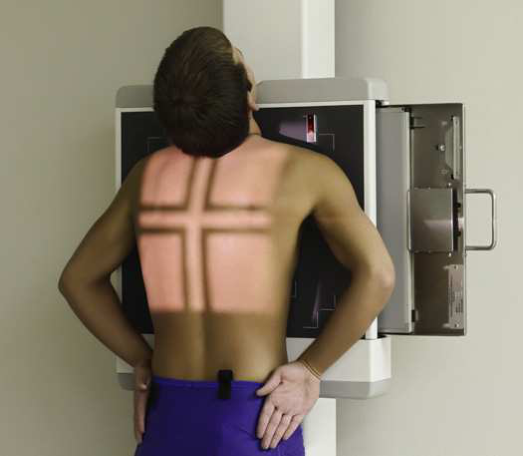
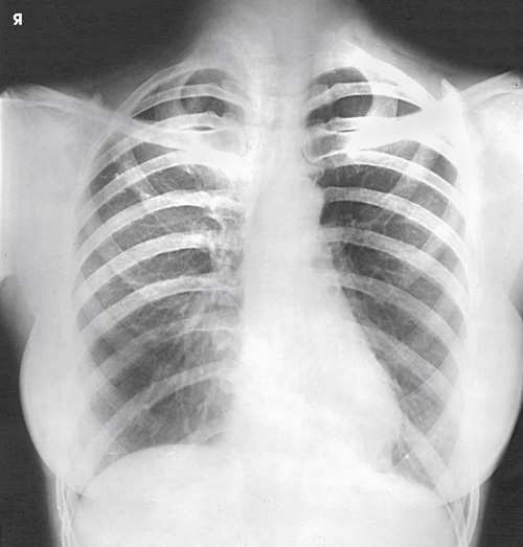
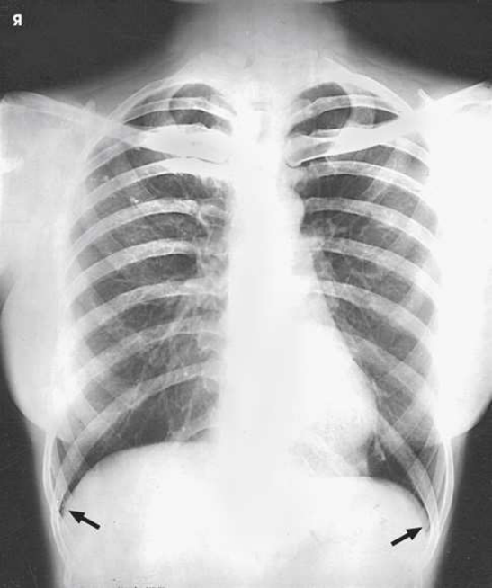
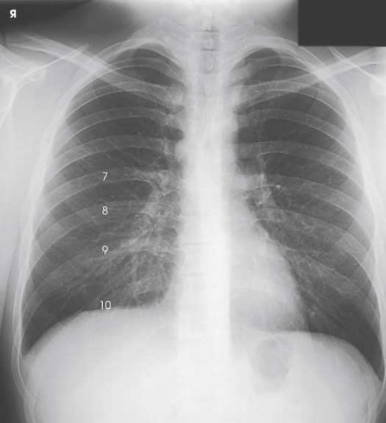
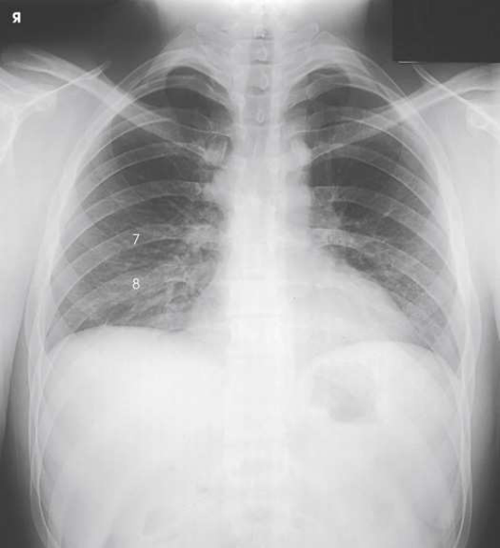
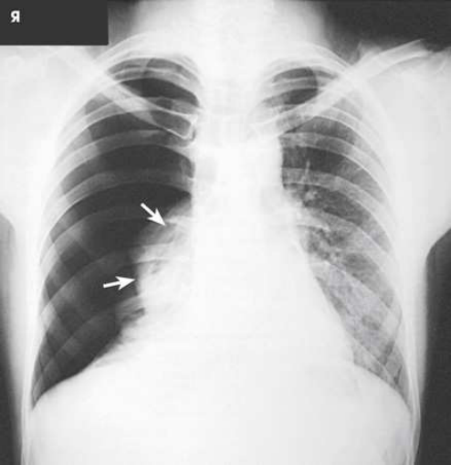
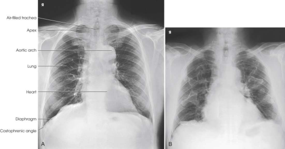

# Rx Torace — Incidență Postero-Anterioară (PA) (Merrill)

  📷 Radiografie Convențională (Rx)
  <strong>Actualizat:</strong> 2026-09-16
  <strong>Autor:</strong> Referință Merrill

---

-   __1. Rezumat Clinic & Indicații__

    ---

    === "Indicații Clinice"

        - Conform reperelor anatomice standard din tratat

    === "Ghid Național IRIS"

        !!! info "Referință Primară: Ghidul Național IRIS (Ordinul MS 1342/2012)"
            - **Capitol Ghid IRIS:** *Torace & Pulmon*
            - **Grad de Recomandare:** **Grad A**
            - **Nivel de Iradiere Estimată:** `Clasa 1 (Minimă < 0.1 mSv)`

            [:octicons-search-16: Deschide Ghidul IRIS](../../iris.md){ .md-button .md-button--primary } [:material-open-in-new: Aplicația Oficială PWA](https://radiologie-pediatrica.ro/iris/){ .md-button target="_blank" rel="noopener" }

-   __2. Poziționare & Centrare Fascicul__

    ---

    - **Poziție Pacient:** Dacă este posibil, pacienții se examinează întotdeauna cu trunchiul vertical, în ortostatism sau așezați pe scaun, astfel încât cupolele diafragmatice să fie în poziția cea mai joasă și să se poată vizualiza aerul sau nivelurile hidroaerice. Se evită și congestia vaselor pulmonare. Pacienții de pe targă pot fi radiografiați în șezut, cu picioarele atârnând peste marginea tărgii, dacă starea lor permite. Se poziționează pacientul în fața stativului vertical Bucky, cu brațele pe lângă corp. Se ajustează înălțimea receptorului de imagine astfel încât marginea superioară să fie la 1.5 până la 2 inci (3.8 până la 5 cm) deasupra umerilor relaxați. Se centrează planul mediosagital al corpului pacientului pe linia mediană a receptorului de imagine. Se instruiește pacientul să stea drept, cu greutatea corpului distribuită egal pe picioare. Se ridică bărbia pacientului sau se așază peste marginea superioară a dispozitivului cu grilă, apoi se ajustează capul astfel încât planul mediosagital să fie vertical. Se instruiește pacientul să flecteze coatele și să sprijine fețele dorsale ale mâinilor jos, pe șolduri, sub nivelul sinusurilor costodiafragmatice. Se coboară umerii și se ajustează în același plan transversal. Aceste mișcări poziționează claviculele sub apexurile (vârfurile pulmonare) plămânilor. Se rotesc umerii înainte astfel încât ambii să atingă stativul vertical Bucky. Această mișcare rotește scapulele spre exterior și lateral pentru a reduce suprapunerea lor peste plămâni (Fig. 3.34). Dacă sânii pacientei sunt suficient de mari încât să se suprapună peste partea inferioară a câmpurilor pulmonare, mai ales peste sinusurile costodiafragmatice, pacienta este instruită să îi ridice și să îi deplaseze lateral. Acest lucru este deosebit de important când se urmărește excluderea prezenței lichidului. Pacienta este instruită să mențină sânii în poziție prin sprijinirea de suportul receptorului de imagine (Fig. 3.35 și 3.36). Se efectuează ecranarea gonadelor cu șorț plumbat.
    - **Punct de Centrare Fascicul:** Perpendicular pe centrul receptorului de imagine. Raza centrală trebuie să pătrundă la nivelul T7 (unghiul inferior al omoplatului (scapulei)).
    - **Distanță Focar-Film (DFF / SID):** Se recomandă o SID minimă de 72 inci (183 cm), pentru a reduce magnificarea inimii și a crește rezoluția spațială a structurilor toracice.
    - **Comandă Respiratorie:** Inspir profund complet. Expunerea se efectuează după al doilea inspir profund complet, pentru a asigura expansiunea maximă a plămânilor. Plămânii se extind transversal, anteroposterior și vertical, expansiunea verticală fiind cea mai mare. Pentru anumite afecțiuni, precum pneumotoraxul (colapsul pulmonar) și prezența unui corp străin / unor corpuri străine radioopace, radiografiile se efectuează uneori la sfârșitul inspirului profund complet și al expirului (Fig. 3.37 până la 3.39). Pneumotoraxul (colapsul pulmonar) se vizualizează mai clar în expir, deoarece colapsul plămânului este accentuat.

-   __3. Parametri Tehnici Expunere__

    ---

    | Parametru Tehnic | Valoare Configurare Generator / Tub |
    |:-----------------|:-------------------------------------|
    | **Tensiune Tub (kV)** | DE CONFIGURAT PE APARAT |
    | **Sarcină / Produs Curent-Timp (mAs)** | DE CONFIGURAT PE APARAT |
    | **Distanță Focar-Film (DFF / SID)** | Se recomandă o SID minimă de 72 inci (183 cm), pentru a reduce magnificarea inimii și a crește rezoluția spațială a structurilor toracice. |
    | **Grilă Antidifuzoare (Bucky)** | DE CONFIGURAT PE APARAT |
    | **Dimensiune Focar** | DE CONFIGURAT PE APARAT |
    | **Camere de Ionizare AEC** | DE CONFIGURAT PE APARAT |
    | **Colimare Fascicul** | Se ajustează câmpul de iradiere la 17 inci (43 cm) longitudinal și la 1 țol (2.5 cm) dincolo de contururile laterale, dar fără a depăși 14 inci (35 cm). Pentru receptorul de imagine orientat transversal, dimensiunile se inversează. Dimensiunea verticală poate fi mai mică la pacienții de talie mică. Se plasează markerul de lateralitate (D/S) în câmpul de expunere colimat. |
    | **Filtrare Tub** | DE CONFIGURAT PE APARAT |

-   __4. Criterii de Calitate & Reușită Imagine__

    ---

    - Criterii radiologice de calitate a imaginii:
    - Evidențierea colimării corecte și prezența markerului de lateralitate (D/S), plasat fără a se suprapune peste anatomia de interes
    - Plămânii în întregime, de la apexuri (vârfuri pulmonare) până la sinusurile costodiafragmatice
    - Absența rotației anatomice (simetrie bilaterală perfectă)
    - Capetele sternale ale claviculelor echidistante față de coloana vertebrală
    - Traheea vizibilă pe linia mediană
    - Distanță egală de la coloana vertebrală la marginea laterală a coastelor (grilajului costal) de fiecare parte
    - Rotația anterioară corectă a umerilor, evidențiată prin proiectarea scapulelor în afara câmpurilor pulmonare
    - Inspir corect, evidențiat prin 10 coaste posterioare (grilaj costal) vizibile deasupra cupolelor diafragmatice; în expir este vizibilă cel puțin o coastă mai puțin
    - Contururi nete ale cordului și cupolelor diafragmatice
    - Umbre slabe ale coastelor (grilajului costal) și ale coloanei toracale superioare, vizibile prin umbra cordului
    - Desenul vascular pulmonar de la regiunile hilare până la periferia plămânilor

-   __5. Protecție Radiologică (ALARA)__

    ---

    - Nespecificat în fragmentul extras; de verificat în sursă

!!! note "Observații Clinice & Tehnice"
    La femeile cu sâni mari, ptozați, trebuie verificată atent penetrarea adecvată la nivelul lobilor inferiori ai ambilor plămâni. Examinări cardiace cu bariu Radiografiile toracice PA pot fi obținute în timp ce pacientul înghite un bol de sulfat de bariu, pentru a contura posterior silueta cardiovasculară și aorta. Bariul utilizat la examinările cardiace trebuie să fie mai vâscos decât cel utilizat pentru stomac, astfel încât substanța de contrast să coboare mai lent și să adere la pereții esofagieni. Pacientul trebuie să țină bariul în gură până imediat înainte de expunere. Apoi pacientul trebuie să inspire profund și să înghită bolul de bariu; expunerea se efectuează în acest moment (vezi Fig. 3.12).

### 🖼️ Imagini

<figure class="protocol-image-card" markdown>

<figcaption><strong>Merrill — pagina 168, imaginea 1</strong> — Imagine din fragmentul sursă; asocierea necesită revizie.</figcaption>

</figure>

<figure class="protocol-image-card" markdown>

<figcaption><strong>Merrill — pagina 169, imaginea 2</strong> — Imagine din fragmentul sursă; asocierea necesită revizie.</figcaption>

</figure>

<figure class="protocol-image-card" markdown>

<figcaption><strong>Merrill — pagina 170, imaginea 3</strong> — Imagine din fragmentul sursă; asocierea necesită revizie.</figcaption>

</figure>

<figure class="protocol-image-card" markdown>

<figcaption><strong>Merrill — pagina 171, imaginea 4</strong> — Imagine din fragmentul sursă; asocierea necesită revizie.</figcaption>

</figure>

<figure class="protocol-image-card" markdown>

<figcaption><strong>Merrill — pagina 172, imaginea 5</strong> — Imagine din fragmentul sursă; asocierea necesită revizie.</figcaption>

</figure>

<figure class="protocol-image-card" markdown>

<figcaption><strong>Merrill — pagina 173, imaginea 6</strong> — Imagine din fragmentul sursă; asocierea necesită revizie.</figcaption>

</figure>

<figure class="protocol-image-card" markdown>

<figcaption><strong>Merrill — pagina 174, imaginea 7</strong> — Imagine din fragmentul sursă; asocierea necesită revizie.</figcaption>

</figure>

=== "Ghid Rapid de Execuție"

    1. **Identificarea și verificarea pacientului:** verificare identitate, zonă de examinat, consimțământ conform procedurii și evaluarea posibilității unei sarcini, când este relevantă.
    2. **Pregătire:** îndepărtarea oricăror obiecte radiopace (bijuterii, agrafe, fermoare, proteze, pansamente dense).
    3. **Poziționare precisă:** alinierea receptorului de imagine și a tubului la distanța prescrisă (Se recomandă o SID minimă de 72 inci (183 cm), pentru a reduce magnificarea inimii și a crește rezoluția spațială a structurilor toracice.).
    4. **Colimare strictă:** adaptarea fasciculului strict la regiunea de diagnostic pentru scăderea iradierii și reducerea radiației difuze.
    5. **Radioprotecție:** verificarea [politicii RX](../radioprotectie.md), cu măsuri distincte pentru pacient, personal și însoțitor.

## Surse de documentare

- [Merrill’s Atlas, 3. Thoracic Viscera: Chest and Upper Airway, pagini 167–174](https://books.google.com/books/about/Merrill_s_Atlas_of_Radiographic_Position.html?id=BM0lEQAAQBAJ)
