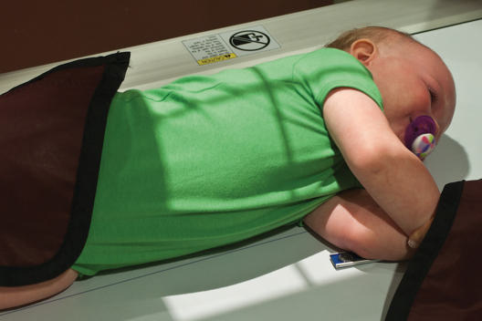
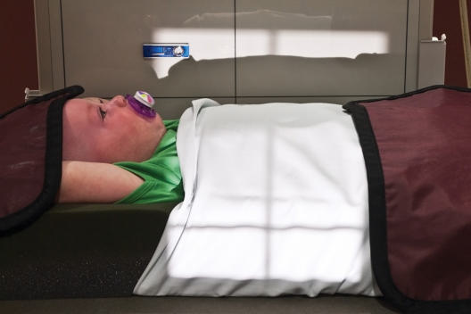

# Rx Torace Profil (Lateral) Torace

  📷 Radiografie Convențională (Rx)
  <strong>Actualizat:</strong> 2026-09-15
  <strong>Autor:</strong> Departamentul de Radiologie / Referință Bontrager

---

-   __1. Rezumat Clinic & Indicații__

    ---

    === "Indicații Clinice"

        - Pathology involving câmpuri pulmonare, trachea, cupole diafragmatice, heart, și Grilaj Costal și Stern
        - Hemothorax sau edem pulmonar acut / congestie; orizontal fascicul incidență este needed la visualize airfluid levels

    === "Ghid Național IRIS"

        !!! info "Referință Primară: Ghidul Național IRIS (Ordinul MS 1342/2012)"
            - **Capitol Ghid IRIS:** *Ghidul Național IRIS*
            - **Grad de Recomandare:** **De verificat pe indicație; fără grad atribuit automat**
            - **Nivel de Iradiere Estimată:** `De verificat pentru examinarea și populația selectate`

            [:octicons-search-16: Deschide Ghidul IRIS](../../iris.md){ .md-button .md-button--primary } [:material-open-in-new: Aplicația Oficială PWA](https://radiologie-pediatrica.ro/iris/){ .md-button target="_blank" rel="noopener" }
-   __2. Poziționare & Centrare Fascicul__

    ---

    - **Poziție Pacient:** Pacient: pacient Decubit imobilizare techniques trebuie să fie used when necessary. pacient este culcat pe side în true lateral (generally stâng lateral) poziție (Fig. 16.26) cu brațe extins above cap la remove brațe de la câmpuri pulmonare. Bend brațe la coate pentru pacient comfort și stability cu cap plasat între brațe. If immobilizer este used, pacient poziție does nu change de la Incidență Antero-Posterioară (AP). Turn xray tube into orizontal fascicul incidență. Place imobilizat child adjacent la receptorul de imagine (Fig. 16.27). If parental assistance este required, perform following steps: 1. Place pacient pe receptorul de imagine în stâng Incidență de Profil (lateral) (unless drept lateral este indicated). 2. Bring brațe above capul și hold cu one Mână. Place other Mână across pacient’s lateral hips la prevent child de la rotating sau twisting. 3. Place parent în poziție that does nu obstruct technologist’s incidență de pacient while expunere este made. 4. Place lead gloves sau shield over top de parent’s mâini if parent este nu wearing gloves.; Regiune anatomică: se așază pacientul în middle de receptorul de imagine cu umerii about 2 inches (5 cm) below top de receptorul de imagine. Absența rotației anatomice: clavicule echidistante față de linia apofizelor spinoase trebuie să exist; ensure true Incidență de Profil (lateral).
    - **Punct de Centrare Fascicul:** perpendicular pe receptorul de imagine centrat pe planul mediocoronal la nivelul mammillary (nipple) line
    - **Distanță Focar-Film (DFF / SID):** 150 cm
    - **Comandă Respiratorie:** și make expunere when child fully inhales. Torace ROUTINE AP sau PA lateral Fig. 16.27 Decubit dorsal orizontal fascicul lateral Torace (using child immobilizer). Fig. 16.26 Decubit lateral Torace (cu imobilizare aids).

-   __3. Parametri Tehnici Expunere__

    ---

    | Parametru Tehnic | Valoare Configurare Generator / Tub |
    |:-----------------|:-------------------------------------|
    | **Tensiune Tub (kV)** | 80-85 kV |
    | **Sarcină / Produs Curent-Timp (mAs)** | DE CONFIGURAT PE APARAT |
    | **Distanță Focar-Film (DFF / SID)** | 150 cm |
    | **Grilă Antidifuzoare (Bucky)** | Cu grilă antidifuzoare Bucky |
    | **Dimensiune Focar** | Focar Mare (1.0 - 1.2 mm) |
    | **Camere de Ionizare AEC** | Camerele laterale (sau camera centrală funcție de regiune) |
    | **Colimare Fascicul** | Field Size Closely collimate pe four sides la outer Torace margins. |
    | **Filtrare Tub** | Totală ≥ 2.5 mm Al echivalent |

-   __4. Criterii de Calitate & Reușită Imagine__

    ---

    - Vizualizarea completă regiunii anatomice explorate
    - Absența artefactelor de mișcare sau suprapunerilor neadecvate
    - Contrast și penetrare optime pentru decelarea structurilor osoase și părților moi

-   __5. Protecție Radiologică (ALARA)__

    ---

    - Ecranare gonadică și a organelor radiosensibile conform procedurilor locale de radioprotecție ALARA.
    - Colimare strictă la aria de interes pentru limitarea radiației difuze.
    - Verificarea posibilității unei sarcini la pacientele de vârstă fertilă înainte de expunere.

### 🖼️ Imagini

<figure class="protocol-image-card" markdown>

<figcaption><strong>Fig. 16.27 Decubit dorsal orizontal fascicul lateral Torace (using child</strong> — Poziționare pacient conform Ghidului Bontrager (Fig. 16.27 în decubit dorsal orizontal fascicul lateral chest (using child)</figcaption>

</figure>

<figure class="protocol-image-card" markdown>

<figcaption><strong>Fig. 16.26 Decubit lateral Torace (cu imobilizare aids).</strong> — Aspect radiografic de referință conform Ghidului Bontrager (Fig. 16.26 Recumbent lateral chest (cu imobilizare aids).)</figcaption>

</figure>

=== "Ghid Rapid de Execuție"

    1. **Identificarea și verificarea pacientului:** verificare identitate, zonă de examinat, consimțământ conform procedurii și evaluarea posibilității unei sarcini, când este relevantă.
    2. **Pregătire:** îndepărtarea oricăror obiecte radiopace (bijuterii, agrafe, fermoare, proteze, pansamente dense).
    3. **Poziționare precisă:** alinierea receptorului de imagine și a tubului la distanța prescrisă (150 cm).
    4. **Colimare strictă:** adaptarea fasciculului strict la regiunea de diagnostic pentru scăderea iradierii și reducerea radiației difuze.
    5. **Radioprotecție:** verificarea [politicii RX](../radioprotectie.md), cu măsuri distincte pentru pacient, personal și însoțitor.

## Surse de documentare

- [Bontrager's Textbook of Radiographic Positioning (Ed. 9/10), Pagina 655](https://www.elsevier.com/books/textbook-of-radiographic-positioning-and-related-anatomy/lampignano/978-0-323-65367-1)
