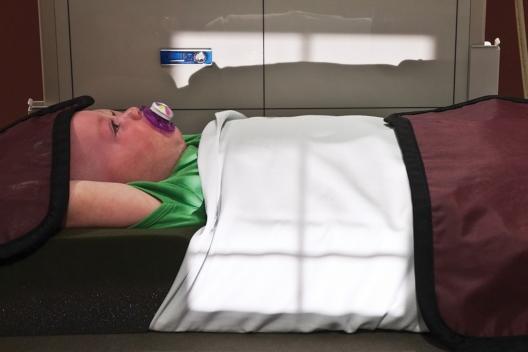

# Radiografie toracică de profil (lateral)

  📷 Radiografie Convențională (Rx)
  <strong>Actualizat:</strong> 2026-09-15
  <strong>Autor:</strong> Departamentul de Radiologie / Referință Bontrager

---

-   __1. Rezumat Clinic & Indicații__

    ---

    === "Indicații Clinice"

        - Patologie care implică câmpurile pulmonare, traheea, cupolele diafragmatice, cordul, grilajul costal și sternul
        - Hemotorax sau edem pulmonar acut / congestie; este necesar un fascicul orizontal pentru vizualizarea nivelurilor hidroaerice

    === "Ghid Național IRIS"

        !!! info "Referință Primară: Ghidul Național IRIS (Ordinul MS 1342/2012)"
            - **Capitol Ghid IRIS:** *Torace & Pulmon*
            - **Grad de Recomandare:** **Grad A**
            - **Nivel de Iradiere Estimată:** `Clasa 1 (Minimă < 0.1 mSv)`

            [:octicons-search-16: Deschide Ghidul IRIS](../../iris.md){ .md-button .md-button--primary } [:material-open-in-new: Aplicația Oficială PWA](https://radiologie-pediatrica.ro/iris/){ .md-button target="_blank" rel="noopener" }

-   __2. Poziționare & Centrare Fascicul__

    ---

    - **Poziție Pacient:** Pacient: pacient. Tehnicile de imobilizare în decubit trebuie utilizate când este necesar. Pacientul este culcat pe o parte, în poziție de profil adevărată (în general cu partea stângă în jos) (Fig. 16.26), cu brațele extinse deasupra capului pentru a îndepărta brațele din câmpurile pulmonare. Se flectează brațele la coate pentru confortul și stabilitatea pacientului, cu capul poziționat între brațe. Dacă se utilizează un imobilizator, poziția pacientului nu se modifică față de incidența anteroposterioară (AP). Se rotește tubul radiogen pentru a obține un fascicul orizontal. Se așază copilul imobilizat adiacent receptorului de imagine (Fig. 16.27). Dacă este necesară asistența părintelui, se efectuează următorii pași: 1. Se așază pacientul pe receptorul de imagine în incidență de profil stâng (cu excepția cazului în care este indicată partea dreaptă). 2. Se aduc brațele deasupra capului și se țin cu o mână. Se așază cealaltă mână peste șoldurile laterale ale pacientului pentru a împiedica rotirea sau răsucirea copilului. 3. Se poziționează părintele astfel încât să nu obstrucționeze incidența pacientului realizată de tehnician în timpul expunerii. 4. Se așază mănuși sau un scut plumbat peste mâinile părintelui, dacă părintele nu poartă mănuși.; Regiune anatomică: se așază pacientul în mijlocul receptorului de imagine, cu umerii la aproximativ 2 țoli (5 cm) sub marginea superioară a receptorului de imagine. Absența rotației anatomice: claviculele echidistante față de linia apofizelor spinoase trebuie să fie prezente; se asigură o incidență de profil adevărată.
    - **Punct de Centrare Fascicul:** Perpendicular pe receptorul de imagine, centrat pe planul mediocoronal la nivelul liniei mamelonare
    - **Distanță Focar-Film (DFF / SID):** 150 cm
    - **Comandă Respiratorie:** și se efectuează expunerea când copilul inspiră complet. Torace — INCIDENȚĂ AP sau PA de rutină, laterală. Fig. 16.27 Decubit dorsal, fascicul orizontal lateral, torace (folosind imobilizator pentru copil). Fig. 16.26 Decubit lateral, torace (cu dispozitive de imobilizare).

-   __3. Parametri Tehnici Expunere__

    ---

    | Parametru Tehnic | Valoare Configurare Generator / Tub |
    |:-----------------|:-------------------------------------|
    | **Tensiune Tub (kV)** | 80-85 kV |
    | **Sarcină / Produs Curent-Timp (mAs)** | DE CONFIGURAT PE APARAT |
    | **Distanță Focar-Film (DFF / SID)** | 150 cm |
    | **Grilă Antidifuzoare (Bucky)** | Cu grilă antidifuzoare Bucky |
    | **Dimensiune Focar** | Focar Mare (1.0 - 1.2 mm) |
    | **Camere de Ionizare AEC** | Camerele laterale (sau camera centrală, în funcție de regiune) |
    | **Colimare Fascicul** | Dimensiunea câmpului: se colimează strâns pe cele patru laturi la marginile externe ale toracelui. |
    | **Filtrare Tub** | Totală ≥ 2.5 mm Al echivalent |

-   __4. Criterii de Calitate & Reușită Imagine__

    ---

    - Vizualizarea completă a regiunii anatomice explorate
    - Absența artefactelor de mișcare sau a suprapunerilor neadecvate
    - Contrast și penetrare optime pentru decelarea structurilor osoase și a părților moi

-   __5. Protecție Radiologică (ALARA)__

    ---

    - Ecranare gonadică și a organelor radiosensibile conform procedurilor locale de radioprotecție ALARA.
    - Colimare strictă la aria de interes pentru limitarea radiației difuze.
    - Verificarea posibilității unei sarcini la pacientele de vârstă fertilă înainte de expunere.

### 🖼️ Imagini

<figure class="protocol-image-card" markdown>

![Fig. 16.27 Torace de profil în decubit dorsal, cu fascicul orizontal (folosind un copil [fragment incomplet în sursă]).](../../assets/images/protocols/bontrager/rx-torace-lateral-torace-position-bontrager/fig_1.jpeg)

<figcaption><strong>Fig. 16.27 Torace de profil în decubit dorsal, cu fascicul orizontal (folosind un copil [fragment incomplet în sursă]).</strong> — Poziționarea pacientului conform Ghidului Bontrager (Fig. 16.27 Torace de profil în decubit dorsal, cu fascicul orizontal, folosind un copil [fragment incomplet în sursă]).</figcaption>

</figure>

<figure class="protocol-image-card" markdown>

<figcaption><strong>Fig. 16.26 Torace în decubit lateral (cu dispozitive de imobilizare).</strong> — Aspect radiografic de referință conform Ghidului Bontrager (Fig. 16.26 Torace de profil în decubit, cu dispozitive de imobilizare).</figcaption>

</figure>

=== "Ghid Rapid de Execuție"

    1. **Identificarea și verificarea pacientului:** verificare identitate, zonă de examinat, consimțământ conform procedurii și evaluarea posibilității unei sarcini, când este relevantă.
    2. **Pregătire:** îndepărtarea oricăror obiecte radiopace (bijuterii, agrafe, fermoare, proteze, pansamente dense).
    3. **Poziționare precisă:** alinierea receptorului de imagine și a tubului la distanța prescrisă (150 cm).
    4. **Colimare strictă:** adaptarea fasciculului strict la regiunea de diagnostic pentru scăderea iradierii și reducerea radiației difuze.
    5. **Radioprotecție:** verificarea [politicii RX](../radioprotectie.md), cu măsuri distincte pentru pacient, personal și însoțitor.

## Surse de documentare

- [Bontrager's Textbook of Radiographic Positioning (Ed. 9/10), Pagina 655](https://www.elsevier.com/books/textbook-of-radiographic-positioning-and-related-anatomy/lampignano/978-0-323-65367-1)
