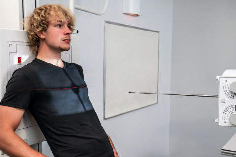
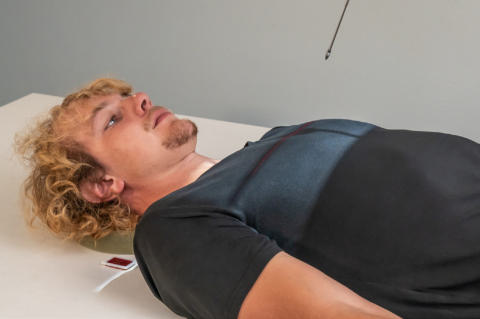
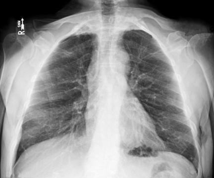

# Rx Torace Lordotică (AP)

  📷 Radiografie Convențională (Rx)
  <strong>Actualizat:</strong> 2026-09-15
  <strong>Autor:</strong> Departamentul de Radiologie / Referință Bontrager

---

-   __1. Rezumat Clinic & Indicații__

    ---

    === "Indicații Clinice"

        - Rule out calcifications and masses beneath the clavicles.

    === "Ghid Național IRIS"

        !!! info "Referință Primară: Ghidul Național IRIS (Ordinul MS 1342/2012)"
            - **Capitol Ghid IRIS:** *Ghidul Național IRIS*
            - **Grad de Recomandare:** **De verificat pe indicație; fără grad atribuit automat**
            - **Nivel de Iradiere Estimată:** `De verificat pentru examinarea și populația selectate`

            [:octicons-search-16: Deschide Ghidul IRIS](../../iris.md){ .md-button .md-button--primary } [:material-open-in-new: Aplicația Oficială PWA](https://radiologie-pediatrica.ro/iris/){ .md-button target="_blank" rel="noopener" }
-   __2. Poziționare & Centrare Fascicul__

    ---

    - **Poziție Pacient:** Pacient: Patient standing about 1 Picior (30 cm) away from IR and leaning back with shoulders, neck, and back of head against IR Both patient’s hands on hips, palmele orientate spre exterior; shoulders rolled forward (Fig. 2.70); Regiune anatomică: Center midsagittal plane to CR and to centerline of IR. Center cassette to CR (top of IR should be about 3 inches [7 to 8 cm] above shoulders on an average patient). Palpate clavicles to ensure they are at level or above shoulders.
    - **Punct de Centrare Fascicul:** perpendicular to IR, centered to midsternum (3 to 4 inches [9 cm] below incizura jugulară (manubriul sternal))
    - **Distanță Focar-Film (DFF / SID):** 180 cm
    - **Comandă Respiratorie:** Apnee în inspir profund complet (după a doua inspirație). Alternative Lordotic Projection If patient is weak and unstable or is unable to assume the Ortostatism lordotic position, an AP semiaxial projection may be taken with the patient in a Decubit Dorsal position (Fig. 2.71). Shoulders are rolled forward and arms positioned as for lordotic position. The CR is directed 15 to 20 degrees cephalad, to the midsternum. Torace SPECIAL AP upright or semierect Lateral decubitus (AP) AP lordotic Fig. 2.70 AP lordotic position. Fig. 2.71 Alternative: semiaxial AP. Fig. 2.72 AP lordotic.

-   __3. Parametri Tehnici Expunere__

    ---

    | Parametru Tehnic | Valoare Configurare Generator / Tub |
    |:-----------------|:-------------------------------------|
    | **Tensiune Tub (kV)** | 110-125 kV |
    | **Sarcină / Produs Curent-Timp (mAs)** | DE CONFIGURAT PE APARAT |
    | **Distanță Focar-Film (DFF / SID)** | 180 cm |
    | **Grilă Antidifuzoare (Bucky)** | Cu grilă antidifuzoare Bucky |
    | **Dimensiune Focar** | Focar Mare (1.0 - 1.2 mm) |
    | **Camere de Ionizare AEC** | Camerele laterale (sau camera centrală funcție de regiune) |
    | **Colimare Fascicul** | Collimate on four sides to area of lung fields (top border of light field to level of vertebra proeminentă (apofiza spinoasă C7)). |
    | **Filtrare Tub** | Totală ≥ 2.5 mm Al echivalent |

-   __4. Criterii de Calitate & Reușită Imagine__

    ---

    - Entire lung fields and clavicles should be included (Fig. 2.72). Position
    - Clavicles should appear nearly horizontal and above or superior to apices, with medial aspects of clavicles superimposed by first Coaste (Grilaj Costal).
    - Coaste (Grilaj Costal) appear distorted, with posterior Coaste (Grilaj Costal) appearing nearly horizontal and superimposing anterior Coaste (Grilaj Costal).
    - Absența rotației anatomice: clavicule echidistante față de linia apofizelor spinoase: Sternal ends of the clavicles should be the same distance from the vertebral column on each side. The lateral borders of the Coaste (Grilaj Costal) on both sides should appear to be at nearly equal distances from the vertebral column.
    - Center of collimation field (CR) should be midsternum with collimation visible on top and bottom. Exposure
    - No motion; diaphragm, heart, and rib outlines should appear sharp.
    - Optimal image receptor exposure and contrast should allow visualization of the faint vascular markings of lungs, especially in area of the apices and upper lungs.

-   __5. Protecție Radiologică (ALARA)__

    ---

    - Ecranare gonadică și a organelor radiosensibile conform procedurilor locale de radioprotecție ALARA.
    - Colimare strictă la aria de interes pentru limitarea radiației difuze.
    - Verificarea posibilității unei sarcini la pacientele de vârstă fertilă înainte de expunere.

### 🖼️ Imagini

<figure class="protocol-image-card" markdown>

<figcaption><strong>Fig. 2.70 AP lordotic position.</strong> — Poziționare pacient conform Ghidului Bontrager (Fig. 2.70 AP lordotic position.)</figcaption>

</figure>

<figure class="protocol-image-card" markdown>

<figcaption><strong>Fig. 2.71 Alternative: semiaxial AP.</strong> — Aspect radiografic de referință conform Ghidului Bontrager (Fig. 2.71 Alternative: semiaxial AP.)</figcaption>

</figure>

<figure class="protocol-image-card" markdown>

<figcaption><strong>Fig. 2.72 AP lordotic.</strong> — Aspect radiografic de referință conform Ghidului Bontrager (Fig. 2.72 AP lordotic.)</figcaption>

</figure>

=== "Ghid Rapid de Execuție"

    1. **Identificarea și verificarea pacientului:** verificare identitate, zonă de examinat, consimțământ conform procedurii și evaluarea posibilității unei sarcini, când este relevantă.
    2. **Pregătire:** îndepărtarea oricăror obiecte radiopace (bijuterii, agrafe, fermoare, proteze, pansamente dense).
    3. **Poziționare precisă:** alinierea receptorului de imagine și a tubului la distanța prescrisă (180 cm).
    4. **Colimare strictă:** adaptarea fasciculului strict la regiunea de diagnostic pentru scăderea iradierii și reducerea radiației difuze.
    5. **Radioprotecție:** verificarea [politicii RX](../radioprotectie.md), cu măsuri distincte pentru pacient, personal și însoțitor.

## Surse de documentare

- [Bontrager's Textbook of Radiographic Positioning (Ed. 9/10), Pagina 108](https://www.elsevier.com/books/textbook-of-radiographic-positioning-and-related-anatomy/lampignano/978-0-323-65367-1)
