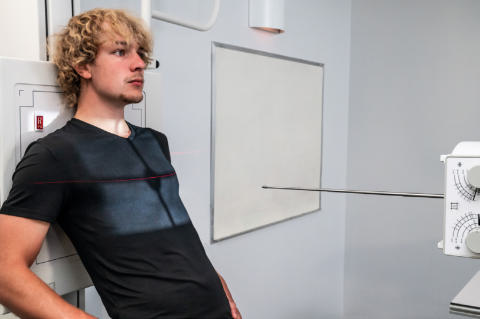
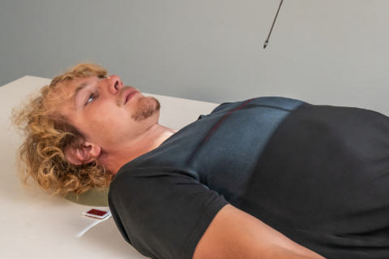
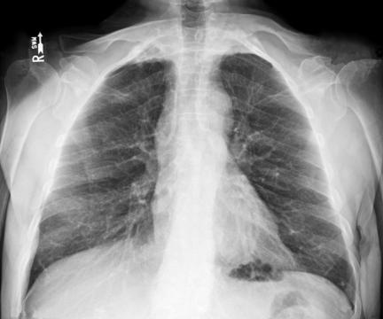

# Rx Torace Lordotică (AP)

  📷 Radiografie Convențională (Rx)
  <strong>Actualizat:</strong> 2026-09-15
  <strong>Autor:</strong> Departamentul de Radiologie / Referință Bontrager

---

-   __1. Rezumat Clinic & Indicații__

    ---

    === "Indicații Clinice"

        - Excludeți calcificările și masele de sub clavicule.

    === "Ghid Național IRIS"

        !!! info "Referință Primară: Ghidul Național IRIS (Ordinul MS 1342/2012)"
            - **Capitol Ghid IRIS:** *Torace & Pulmon*
            - **Grad de Recomandare:** **Grad A**
            - **Nivel de Iradiere Estimată:** `Clasa 1 (Minimă < 0.1 mSv)`

            [:octicons-search-16: Deschide Ghidul IRIS](../../iris.md){ .md-button .md-button--primary } [:material-open-in-new: Aplicația Oficială PWA](https://radiologie-pediatrica.ro/iris/){ .md-button target="_blank" rel="noopener" }

-   __2. Poziționare & Centrare Fascicul__

    ---

    - **Poziție Pacient:** Pacient: pacientul în ortostatism, la aproximativ 1 picior (30 cm) de receptorul de imagine și aplecat pe spate, cu umerii, gâtul și partea posterioară a capului sprijinite de receptorul de imagine; ambele mâini ale pacientului pe șolduri, cu palmele orientate spre exterior; umerii rulați înainte (Fig. 2.70). Regiune anatomică: centrați planul mediosagital pe raza centrală și pe linia mediană a receptorului de imagine. Centrați caseta pe raza centrală (partea superioară a receptorului de imagine trebuie să fie la aproximativ 3 țoli [7 până la 8 cm] deasupra umerilor la pacientul mediu). Palpați claviculele pentru a vă asigura că sunt la nivelul umerilor sau deasupra acestora.
    - **Punct de Centrare Fascicul:** perpendicular pe receptorul de imagine, centrată pe mijlocul sternului (3 până la 4 țoli [9 cm] sub incizura jugulară (manubriul sternal))
    - **Distanță Focar-Film (DFF / SID):** 180 cm
    - **Comandă Respiratorie:** Apnee la inspir profund complet (după a doua inspirație). Incidență lordotică alternativă: dacă pacientul este slăbit și instabil sau nu poate adopta poziția lordotică în ortostatism, se poate efectua o incidență AP semiaxială cu pacientul în decubit dorsal (Fig. 2.71). Umerii sunt rulați înainte, iar brațele sunt poziționate ca pentru poziția lordotică. Raza centrală este orientată la 15 până la 20 de grade cranial, spre mijlocul sternului. Proiecții speciale toracice: AP în ortostatism sau semierectă; laterală în decubit (AP); AP lordotică. Fig. 2.70 Poziție AP lordotică. Fig. 2.71 Alternativă: AP semiaxială. Fig. 2.72 AP lordotic.

-   __3. Parametri Tehnici Expunere__

    ---

    | Parametru Tehnic | Valoare Configurare Generator / Tub |
    |:-----------------|:-------------------------------------|
    | **Tensiune Tub (kV)** | 110-125 kV |
    | **Sarcină / Produs Curent-Timp (mAs)** | DE CONFIGURAT PE APARAT |
    | **Distanță Focar-Film (DFF / SID)** | 180 cm |
    | **Grilă Antidifuzoare (Bucky)** | Cu grilă antidifuzoare Bucky |
    | **Dimensiune Focar** | Focar Mare (1.0 - 1.2 mm) |
    | **Camere de Ionizare AEC** | Camerele laterale (sau camera centrală, în funcție de regiune) |
    | **Colimare Fascicul** | Colimați pe cele patru laturi la zona câmpurilor pulmonare (marginea superioară a câmpului luminos la nivelul vertebrei proeminente, apofiza spinoasă C7). |
    | **Filtrare Tub** | Totală ≥ 2.5 mm Al echivalent |

-   __4. Criterii de Calitate & Reușită Imagine__

    ---

    - Întregul câmp pulmonar și toate câmpurile pulmonare trebuie să fie incluse (Fig. 2.72). Poziție.
    - Claviculele trebuie să apară aproape orizontal și deasupra apexurilor (vârfurilor pulmonare), cu aspectele mediale ale claviculelor suprapuse peste primele coaste (grilaj costal).
    - Coastele (grilaj costal) apar deformate, coastele posterioare apar aproape orizontal și se suprapun peste coastele anterioare (grilaj costal).
    - Absența rotației anatomice: claviculele sunt echidistante față de linia apofizelor spinoase. Extremitățile sternale ale claviculelor trebuie să fie la aceeași distanță de coloana vertebrală pe fiecare parte. Marginile laterale ale coastelor (grilaj costal) de pe ambele părți trebuie să apară la distanțe aproape egale față de coloana vertebrală.
    - Centrul câmpului de colimare (raza centrală) trebuie să fie la mijlocul sternului, cu colimarea vizibilă sus și jos. Expunere.
    - fără mișcare; cupole diafragmatice, inima, și contururile coastelor trebuie să apară clare.
    - Expunerea optimă a receptorului de imagine și contrastul trebuie să permită vizualizarea desenului vascular fin al plămânilor, în special în zona apexurilor (vârfurile pulmonare) și a plămânilor superiori.

-   __5. Protecție Radiologică (ALARA)__

    ---

    - Ecranare gonadică și a organelor radiosensibile conform procedurilor locale de radioprotecție ALARA.
    - Colimare strictă la aria de interes pentru limitarea radiației difuze.
    - Verificarea posibilității unei sarcini la pacientele de vârstă fertilă înainte de expunere.

### 🖼️ Imagini

<figure class="protocol-image-card" markdown>

<figcaption><strong>Fig. 2.70 Poziție AP lordotică.</strong> — Poziționarea pacientului conform Ghidului Bontrager (Fig. 2.70 Poziție AP lordotică.)</figcaption>

</figure>

<figure class="protocol-image-card" markdown>

<figcaption><strong>Fig. 2.71 Alternativă: semiaxial AP.</strong> — Aspect radiografic de referință conform Ghidului Bontrager (Fig. 2.71 Alternativă: semiaxial AP.)</figcaption>

</figure>

<figure class="protocol-image-card" markdown>

<figcaption><strong>Fig. 2.72 AP lordotic.</strong> — Aspect radiografic de referință conform Ghidului Bontrager (Fig. 2.72 AP lordotic.)</figcaption>

</figure>

=== "Ghid Rapid de Execuție"

    1. **Identificarea și verificarea pacientului:** verificare identitate, zonă de examinat, consimțământ conform procedurii și evaluarea posibilității unei sarcini, când este relevantă.
    2. **Pregătire:** îndepărtarea oricăror obiecte radiopace (bijuterii, agrafe, fermoare, proteze, pansamente dense).
    3. **Poziționare precisă:** alinierea receptorului de imagine și a tubului la distanța prescrisă (180 cm).
    4. **Colimare strictă:** adaptarea fasciculului strict la regiunea de diagnostic pentru scăderea iradierii și reducerea radiației difuze.
    5. **Radioprotecție:** verificarea [politicii RX](../radioprotectie.md), cu măsuri distincte pentru pacient, personal și însoțitor.

## Surse de documentare

- [Bontrager's Textbook of Radiographic Positioning (Ed. 9/10), Pagina 108](https://www.elsevier.com/books/textbook-of-radiographic-positioning-and-related-anatomy/lampignano/978-0-323-65367-1)
