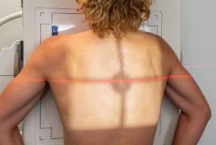
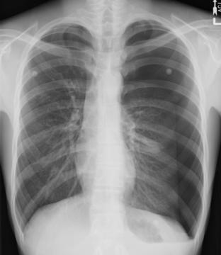
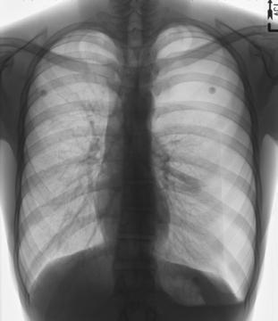

# Rx Torace PA (Postero-Anterior) (Pacient Mobil / Cooperant (Ortostatism))

  📷 Radiografie Convențională (Rx)
  <strong>Actualizat:</strong> 2026-09-15
  <strong>Autor:</strong> Departamentul de Radiologie / Referință Bontrager

---

-   __1. Rezumat Clinic & Indicații__

    ---

    === "Indicații Clinice"

        - When performed Ortostatism, PA demonstrates revărsat pleural (pleurezie), pneumotorax, atelectazie pulmonară, and semne de infecție respiratorie (pneumonie, bronhopneumonie)

    === "Ghid Național IRIS"

        !!! info "Referință Primară: Ghidul Național IRIS (Ordinul MS 1342/2012)"
            - **Capitol Ghid IRIS:** *Ghidul Național IRIS*
            - **Grad de Recomandare:** **De verificat pe indicație; fără grad atribuit automat**
            - **Nivel de Iradiere Estimată:** `De verificat pentru examinarea și populația selectate`

            [:octicons-search-16: Deschide Ghidul IRIS](../../iris.md){ .md-button .md-button--primary } [:material-open-in-new: Aplicația Oficială PWA](https://radiologie-pediatrica.ro/iris/){ .md-button target="_blank" rel="noopener" }
-   __2. Poziționare & Centrare Fascicul__

    ---

    - **Poziție Pacient:** Pacient: Patient Ortostatism, picioarele ușor depărtate pentru stabilitate, greutatea distribuită egal pe ambele picioare Bărbia ridicată și sprijinită pe stativul receptorului Mâinile poziționate pe șolduri, palmele orientate spre exterior, coatele parțial flectate (Fig. 2.52) Umerii rotiți anterior spre receptor pentru degajarea omoplaților to allow scapulae to move laterally clear of lung fields; umerii coborâți pentru eliberarea apexurilor pulmonare to move clavicles below the apices; Regiune anatomică: Alinierea planului medio-sagital cu raza centrală and with midline of IR with equal margins between lateral thorax and sides of IR. Asigurarea lipsei rotației toracelui (simetrie bilaterală) by placing the planul medio-coronal paralel cu receptorul de imagine. Raise or lower CR and IR as needed to the level of T7 for an average patient (top of IR is approximately 1½ to 2 inches [4 to 5 cm] above shoulders on average patients).
    - **Punct de Centrare Fascicul:** perpendicular to IR and centrată pe linia medio-sagitală la nivelul vertebrei T7 (7 to 8 inches [18 to 20 cm] below vertebra proeminentă (apofiza spinoasă C7), or to the inferior angle of Omoplat (Scapulă)) IR centered to CR
    - **Distanță Focar-Film (DFF / SID):** 180 cm
    - **Comandă Respiratorie:** Apnee la sfârșitul celui de-al doilea inspir profund complet.

-   __3. Parametri Tehnici Expunere__

    ---

    | Parametru Tehnic | Valoare Configurare Generator / Tub |
    |:-----------------|:-------------------------------------|
    | **Tensiune Tub (kV)** | 110-125 kV |
    | **Sarcină / Produs Curent-Timp (mAs)** | DE CONFIGURAT PE APARAT |
    | **Distanță Focar-Film (DFF / SID)** | 180 cm |
    | **Grilă Antidifuzoare (Bucky)** | Cu grilă antidifuzoare Bucky |
    | **Dimensiune Focar** | Focar Mare (1.0 - 1.2 mm) |
    | **Camere de Ionizare AEC** | Camerele laterale (sau camera centrală funcție de regiune) |
    | **Colimare Fascicul** | Collimate on four sides to area of lung fields (top border of illuminated field should be to the level of vertebra proeminentă (apofiza spinoasă C7), and lateral border should be to outer skin margins). |
    | **Filtrare Tub** | Totală ≥ 2.5 mm Al echivalent |

-   __4. Criterii de Calitate & Reușită Imagine__

    ---

    - Included are Vizualizarea completă a ambelor câmpuri pulmonare, de la apexuri până la unghiurile costodiafragmatice and the airfilled trachea from T1 down.
    - Hilum region markings, heart, great vessels, and Grilaj Costal și Stern are demonstrated (Figs. 2.53 and 2.54). Position
    - Chin sufficiently elevated to prevent superimposing apices.
    - Sufficient forward Umăr rotation to prevent superimposition of scapulae over lung fields.
    - Larger Mamografie (Sân) shadows (if present) primarily lateral to lung fields.
    - Absența rotației anatomice: clavicule echidistante față de linia apofizelor spinoase: Both sternoclavicular joints the same distance from center line of spine.4
    - Distance from lateral rib margins to vertebral column the same on each side from upper to lower rib cage (see NOTE 2).
    - Collimation margins near equal on top and bottom with center of collimation field (CR) to T7 region on most patients.
    - Inspir profund adecvat: minim 9-10 arcuri costale posterioare vizibile with no motion.
    - Visualizes a minimum of 10 posterior Coaste (Grilaj Costal) above diaphragm (11 on many patients). Exposure
    - No motion, as evidenced by sharp outlines of rib margins, diaphragm, and heart borders and also sharp lung markings in hilar region and throughout lungs.
    - Optimal image receptor exposure with sufficient longscale contrast for visualization of fine vascular markings within lungs.
    - Faint outlines of at least midthoracic and upper thoracic vertebrae and posterior Coaste (Grilaj Costal) visible through heart and mediastinal structures.

-   __5. Protecție Radiologică (ALARA)__

    ---

    - Ecranare gonadică și a organelor radiosensibile conform procedurilor locale de radioprotecție ALARA.
    - Colimare strictă la aria de interes pentru limitarea radiației difuze.
    - Verificarea posibilității unei sarcini la pacientele de vârstă fertilă înainte de expunere.

!!! note "Observații Clinice & Tehnice"
    scolioză / vicii de postură ale coloanei and kyphosis may cause asymmetry of sternoclavicular joints and rib cage margins, as evidenced by R to L spinal curvature.

### 🖼️ Imagini

<figure class="protocol-image-card" markdown>

<figcaption><strong>Fig. 2.52 PA Torace.</strong> — Poziționare pacient conform Ghidului Bontrager (Fig. 2.52 PA chest.)</figcaption>

</figure>

<figure class="protocol-image-card" markdown>

<figcaption><strong>Fig. 2.53 PA Torace.</strong> — Aspect radiografic de referință conform Ghidului Bontrager (Fig. 2.53 PA chest.)</figcaption>

</figure>

<figure class="protocol-image-card" markdown>

<figcaption><strong>Fig. 2.54 PA Torace.</strong> — Aspect radiografic de referință conform Ghidului Bontrager (Fig. 2.54 PA chest.)</figcaption>

</figure>

=== "Ghid Rapid de Execuție"

    1. **Identificarea și verificarea pacientului:** verificare identitate, zonă de examinat, consimțământ conform procedurii și evaluarea posibilității unei sarcini, când este relevantă.
    2. **Pregătire:** îndepărtarea oricăror obiecte radiopace (bijuterii, agrafe, fermoare, proteze, pansamente dense).
    3. **Poziționare precisă:** alinierea receptorului de imagine și a tubului la distanța prescrisă (180 cm).
    4. **Colimare strictă:** adaptarea fasciculului strict la regiunea de diagnostic pentru scăderea iradierii și reducerea radiației difuze.
    5. **Radioprotecție:** verificarea [politicii RX](../radioprotectie.md), cu măsuri distincte pentru pacient, personal și însoțitor.

## Surse de documentare

- [Bontrager's Textbook of Radiographic Positioning (Ed. 9/10), Pagina 102](https://www.elsevier.com/books/textbook-of-radiographic-positioning-and-related-anatomy/lampignano/978-0-323-65367-1)
