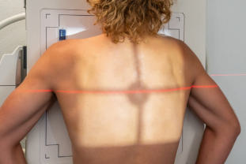
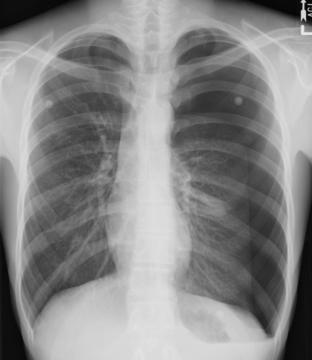
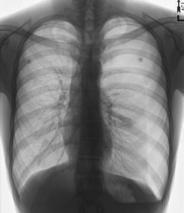

# Rx torace PA (postero-anterior) (pacient mobil / cooperant (ortostatism))

  📷 Radiografie Convențională (Rx)
  <strong>Actualizat:</strong> 2026-09-15
  <strong>Autor:</strong> Departamentul de Radiologie / Referință Bontrager

---

-   __1. Rezumat Clinic & Indicații__

    ---

    === "Indicații Clinice"

        - Când este efectuată în ortostatism, incidența PA evidențiază revărsat pleural (pleurezie), pneumotorax, atelectazie pulmonară și semne de infecție respiratorie (pneumonie, bronhopneumonie).

    === "Ghid Național IRIS"

        !!! info "Referință Primară: Ghidul Național IRIS (Ordinul MS 1342/2012)"
            - **Capitol Ghid IRIS:** *Torace & Pulmon*
            - **Grad de Recomandare:** **Grad A**
            - **Nivel de Iradiere Estimată:** `Clasa 1 (Minimă < 0.1 mSv)`

            [:octicons-search-16: Deschide Ghidul IRIS](../../iris.md){ .md-button .md-button--primary } [:material-open-in-new: Aplicația Oficială PWA](https://radiologie-pediatrica.ro/iris/){ .md-button target="_blank" rel="noopener" }

-   __2. Poziționare & Centrare Fascicul__

    ---

    - **Poziție Pacient:** Pacient: pacient. Ortostatism, picioarele ușor depărtate pentru stabilitate, greutatea distribuită egal pe ambele picioare. Bărbia ridicată și sprijinită pe stativul receptorului. Mâinile poziționate pe șolduri, palmele orientate spre exterior, coatele parțial flectate (Fig. 2.52). Umerii rotiți anterior spre receptor pentru degajarea omoplaților, permițând scapulelor să se deplaseze lateral, în afara câmpurilor pulmonare; umerii coborâți pentru eliberarea apexurilor pulmonare, permițând claviculelor să coboare sub apexuri (vârfuri pulmonare). Regiune anatomică: alinierea planului mediosagital cu raza centrală și cu linia mediană a receptorului de imagine, cu margini egale între toracele lateral și laturile receptorului de imagine. Se asigură absența rotației toracelui (simetrie bilaterală) prin poziționarea planului mediocoronal paralel cu receptorul de imagine. Se ridică sau se coboară raza centrală și receptorul de imagine, după cum este necesar, până la nivelul T7 pentru pacientul mediu (partea superioară a receptorului de imagine este la aproximativ 1½ până la 2 țoli [4 până la 5 cm] deasupra umerilor la pacienții medii).
    - **Punct de Centrare Fascicul:** perpendicular pe receptorul de imagine și centrată pe linia mediosagitală la nivelul vertebrei T7 (7 până la 8 țoli [18 până la 20 cm] sub vertebra proeminentă (apofiza spinoasă C7) sau la unghiul inferior al omoplatului (scapulei)); receptorul de imagine centrat pe raza centrală
    - **Distanță Focar-Film (DFF / SID):** 180 cm
    - **Comandă Respiratorie:** Apnee la sfârșitul celui de-al doilea inspir profund complet.

-   __3. Parametri Tehnici Expunere__

    ---

    | Parametru Tehnic | Valoare Configurare Generator / Tub |
    |:-----------------|:-------------------------------------|
    | **Tensiune Tub (kV)** | 110-125 kV |
    | **Sarcină / Produs Curent-Timp (mAs)** | DE CONFIGURAT PE APARAT |
    | **Distanță Focar-Film (DFF / SID)** | 180 cm |
    | **Grilă Antidifuzoare (Bucky)** | Cu grilă antidifuzoare Bucky |
    | **Dimensiune Focar** | Focar Mare (1.0 - 1.2 mm) |
    | **Camere de Ionizare AEC** | Camerele laterale (sau camera centrală, în funcție de regiune) |
    | **Colimare Fascicul** | Colimați pe cele patru laturi la nivelul câmpurilor pulmonare (marginea superioară a câmpului iluminat trebuie să fie la nivelul vertebrei proeminente (apofiza spinoasă C7), iar marginea laterală trebuie să fie la marginile externe ale pielii). |
    | **Filtrare Tub** | Totală ≥ 2.5 mm Al echivalent |

-   __4. Criterii de Calitate & Reușită Imagine__

    ---

    - Se include vizualizarea completă a ambelor câmpuri pulmonare, de la apexuri până la unghiurile costodiafragmatice, precum și a traheei pline cu aer de la T1 în jos.
    - Desenul regiunii hilare, inima, vasele mari, grilajul costal și sternul sunt evidențiate (Fig. 2.53 și 2.54). Poziție.
    - Bărbia suficient de ridicată pentru a preveni suprapunerea peste apexuri (vârfurile pulmonare).
    - Rotație suficientă a umerilor înainte pentru a preveni suprapunerea omoplaților peste câmpurile pulmonare.
    - Umbrele mamare mai mari (dacă sunt prezente) sunt în principal laterale față de câmpurile pulmonare.
    - Absența rotației anatomice: claviculele sunt echidistante față de linia apofizelor spinoase; ambele articulații sternoclaviculare sunt la aceeași distanță de linia mediană a coloanei vertebrale.4
    - Distanța de la marginile laterale ale coastelor la coloana vertebrală este aceeași pe fiecare parte, de la cutia toracică superioară la cea inferioară (vezi NOTA 2).
    - Marginile colimării sunt aproape egale sus și jos, cu centrul câmpului de colimare (raza centrală) în regiunea T7 la majoritatea pacienților.
    - Inspir profund adecvat: minimum 9-10 arcuri costale posterioare vizibile, fără mișcare.
    - Evidențiază minimum 10 coaste posterioare (grilaj costal) deasupra cupolelor diafragmatice (11 la mulți pacienți). Expunere.
    - Fără mișcare, evidențiată prin contururile clare ale marginilor coastelor, cupolelor diafragmatice și marginilor inimii, precum și prin desenul pulmonar clar în regiunea hilară și în întregul plămân.
    - Expunerea optimă a receptorului de imagine, cu contrast suficient pe scară lungă pentru vizualizarea desenului vascular fin din plămâni.
    - Contururi discrete ale cel puțin coloanei toracale mijlocii și superioare și ale coastelor posterioare (grilaj costal), vizibile prin inimă și structurile mediastinale.

-   __5. Protecție Radiologică (ALARA)__

    ---

    - Ecranare gonadică și a organelor radiosensibile conform procedurilor locale de radioprotecție ALARA.
    - Colimare strictă la aria de interes pentru limitarea radiației difuze.
    - Verificarea posibilității unei sarcini la pacientele de vârstă fertilă înainte de expunere.

!!! note "Observații Clinice & Tehnice"
    Scolioza, viciile de postură ale coloanei și cifoza pot cauza asimetria articulațiilor sternoclaviculare și a marginilor cutiei toracice, evidențiată prin curbura coloanei de la dreapta la stânga.

### 🖼️ Imagini

<figure class="protocol-image-card" markdown>

<figcaption><strong>Fig. 2.52 PA Torace.</strong> — Poziționarea pacientului conform Ghidului Bontrager (Fig. 2.52 torace PA.)</figcaption>

</figure>

<figure class="protocol-image-card" markdown>

<figcaption><strong>Fig. 2.53 PA Torace.</strong> — Aspect radiografic de referință conform Ghidului Bontrager (Fig. 2.53 torace PA.)</figcaption>

</figure>

<figure class="protocol-image-card" markdown>

<figcaption><strong>Fig. 2.54 PA Torace.</strong> — Aspect radiografic de referință conform Ghidului Bontrager (Fig. 2.54 torace PA.)</figcaption>

</figure>

=== "Ghid Rapid de Execuție"

    1. **Identificarea și verificarea pacientului:** verificare identitate, zonă de examinat, consimțământ conform procedurii și evaluarea posibilității unei sarcini, când este relevantă.
    2. **Pregătire:** îndepărtarea oricăror obiecte radiopace (bijuterii, agrafe, fermoare, proteze, pansamente dense).
    3. **Poziționare precisă:** alinierea receptorului de imagine și a tubului la distanța prescrisă (180 cm).
    4. **Colimare strictă:** adaptarea fasciculului strict la regiunea de diagnostic pentru scăderea iradierii și reducerea radiației difuze.
    5. **Radioprotecție:** verificarea [politicii RX](../radioprotectie.md), cu măsuri distincte pentru pacient, personal și însoțitor.

## Surse de documentare

- [Bontrager's Textbook of Radiographic Positioning (Ed. 9/10), Pagina 102](https://www.elsevier.com/books/textbook-of-radiographic-positioning-and-related-anatomy/lampignano/978-0-323-65367-1)
