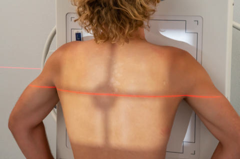
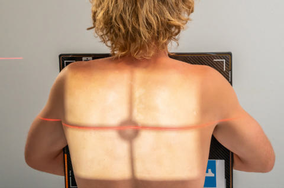
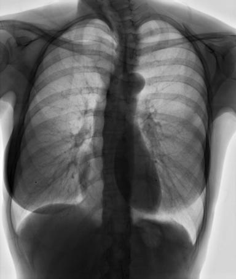

# Rx Torace PA (Postero-Anterior) (Pacient Nedeplasabil / Cărucior / Targă)

  📷 Radiografie Convențională (Rx)
  <strong>Actualizat:</strong> 2026-09-15
  <strong>Autor:</strong> Departamentul de Radiologie / Referință Bontrager

---

-   __1. Rezumat Clinic & Indicații__

    ---

    === "Indicații Clinice"

        - When performed Ortostatism, PA demonstrates revărsat pleural (pleurezie), pneumotorax, atelectazie pulmonară, and semne de infecție respiratorie (pneumonie, bronhopneumonie).

    === "Ghid Național IRIS"

        !!! info "Referință Primară: Ghidul Național IRIS (Ordinul MS 1342/2012)"
            - **Capitol Ghid IRIS:** *Ghidul Național IRIS*
            - **Grad de Recomandare:** **De verificat pe indicație; fără grad atribuit automat**
            - **Nivel de Iradiere Estimată:** `De verificat pentru examinarea și populația selectate`

            [:octicons-search-16: Deschide Ghidul IRIS](../../iris.md){ .md-button .md-button--primary } [:material-open-in-new: Aplicația Oficială PWA](https://radiologie-pediatrica.ro/iris/){ .md-button target="_blank" rel="noopener" }
-   __2. Poziționare & Centrare Fascicul__

    ---

    - **Poziție Pacient:** Pacient: Patient Ortostatism, Poziție Șezândă on cart, legs over the edge (Fig. 2.55) Arms around cassette unless a Torace IR device is used, then position as for an Pacient Mobil / Cooperant (Ortostatism) Shoulders rotated forward and downward; Regiune anatomică: Asigurarea lipsei rotației toracelui (simetrie bilaterală). Adjust height of IR so that top of IR is about 1½ to 2 inches (4 to 5 cm) above top of shoulders and CR is at T7. If portable image receptor is used because patient cannot be placed up against wall bucky, place pillow or padding on lap to raise and support image receptor as shown, but keep it against Torace for minimum object–image receptor distance (OID) (Fig. 2.56).
    - **Punct de Centrare Fascicul:** perpendicular to the IR and centered to the midsagittal plane at the level of T7 (7 to 8 inches [18 to 20 cm] below vertebra proeminentă (apofiza spinoasă C7) or to the inferior angles of scapulae) Cassette centered to level of CR
    - **Distanță Focar-Film (DFF / SID):** 180 cm
    - **Comandă Respiratorie:** Make exposure on second Inspir profund adecvat: minim 9-10 arcuri costale posterioare vizibile.

-   __3. Parametri Tehnici Expunere__

    ---

    | Parametru Tehnic | Valoare Configurare Generator / Tub |
    |:-----------------|:-------------------------------------|
    | **Tensiune Tub (kV)** | 110-125 kV |
    | **Sarcină / Produs Curent-Timp (mAs)** | DE CONFIGURAT PE APARAT |
    | **Distanță Focar-Film (DFF / SID)** | 180 cm |
    | **Grilă Antidifuzoare (Bucky)** | Cu grilă antidifuzoare Bucky |
    | **Dimensiune Focar** | Focar Mare (1.0 - 1.2 mm) |
    | **Camere de Ionizare AEC** | Camerele laterale (sau camera centrală funcție de regiune) |
    | **Colimare Fascicul** | Collimate to area of lung fields. Upper border of illuminated field should be to the level of vertebra proeminentă (apofiza spinoasă C7), which with divergent rays will result in upper collimation border on IR to about 1½ inches (3.5 cm) above apex of lungs. |
    | **Filtrare Tub** | Totală ≥ 2.5 mm Al echivalent |

-   __4. Criterii de Calitate & Reușită Imagine__

    ---

    - Radiograph should appear similar to ambulatory PA Torace, as described on preceding page (Fig. 2.57). Fig. 2.56 PA Torace (patient Poziție Șezândă, holding cassetteless detector). L Fig. 2.57 PA Torace. 35 43 L 43 35 L Fig. 2.55 PA Torace (patient Poziție Șezândă, Torace against wall bucky).

-   __5. Protecție Radiologică (ALARA)__

    ---

    - Ecranare gonadică și a organelor radiosensibile conform procedurilor locale de radioprotecție ALARA.
    - Colimare strictă la aria de interes pentru limitarea radiației difuze.
    - Verificarea posibilității unei sarcini la pacientele de vârstă fertilă înainte de expunere.

!!! note "Observații Clinice & Tehnice"
    Use a compression band or other means to ensure that patient is stable and will not waver or move during exposure. Torace ROUTINE PA Lateral

### 🖼️ Imagini

<figure class="protocol-image-card" markdown>

<figcaption><strong>Fig. 2.56 PA Torace (patient Poziție Șezândă, holding cassette-</strong> — Poziționare pacient conform Ghidului Bontrager (Fig. 2.56 PA chest (patient seated, holding cassette-)</figcaption>

</figure>

<figure class="protocol-image-card" markdown>

<figcaption><strong>Fig. 2.57 PA Torace.</strong> — Aspect radiografic de referință conform Ghidului Bontrager (Fig. 2.57 PA chest.)</figcaption>

</figure>

<figure class="protocol-image-card" markdown>

<figcaption><strong>Fig. 2.55 PA Torace (patient Poziție Șezândă, Torace against wall bucky).</strong> — Aspect radiografic de referință conform Ghidului Bontrager (Fig. 2.55 PA chest (patient seated, chest against wall bucky).)</figcaption>

</figure>

=== "Ghid Rapid de Execuție"

    1. **Identificarea și verificarea pacientului:** verificare identitate, zonă de examinat, consimțământ conform procedurii și evaluarea posibilității unei sarcini, când este relevantă.
    2. **Pregătire:** îndepărtarea oricăror obiecte radiopace (bijuterii, agrafe, fermoare, proteze, pansamente dense).
    3. **Poziționare precisă:** alinierea receptorului de imagine și a tubului la distanța prescrisă (180 cm).
    4. **Colimare strictă:** adaptarea fasciculului strict la regiunea de diagnostic pentru scăderea iradierii și reducerea radiației difuze.
    5. **Radioprotecție:** verificarea [politicii RX](../radioprotectie.md), cu măsuri distincte pentru pacient, personal și însoțitor.

## Surse de documentare

- [Bontrager's Textbook of Radiographic Positioning (Ed. 9/10), Pagina 103](https://www.elsevier.com/books/textbook-of-radiographic-positioning-and-related-anatomy/lampignano/978-0-323-65367-1)
