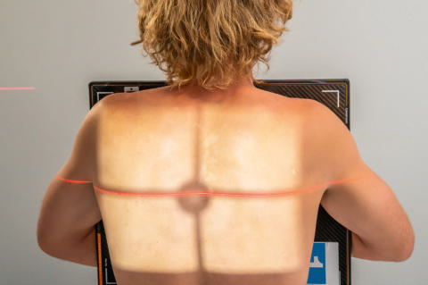
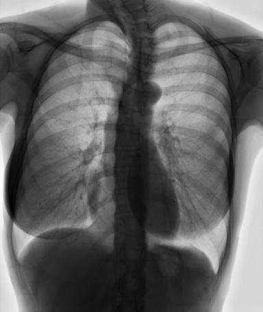

# Rx Torace PA (Postero-Anterior) (Pacient Nedeplasabil / Cărucior / Targă)

  📷 Radiografie Convențională (Rx)
  <strong>Actualizat:</strong> 2026-09-15
  <strong>Autor:</strong> Departamentul de Radiologie / Referință Bontrager

---

-   __1. Rezumat Clinic & Indicații__

    ---

    === "Indicații Clinice"

        - Când este efectuată în ortostatism, incidența PA evidențiază revărsat pleural (pleurezie), pneumotorax, atelectazie pulmonară și semne de infecție respiratorie (pneumonie, bronhopneumonie).

    === "Ghid Național IRIS"

        !!! info "Referință Primară: Ghidul Național IRIS (Ordinul MS 1342/2012)"
            - **Capitol Ghid IRIS:** *Torace & Pulmon*
            - **Grad de Recomandare:** **Grad A**
            - **Nivel de Iradiere Estimată:** `Clasa 1 (Minimă < 0.1 mSv)`

            [:octicons-search-16: Deschide Ghidul IRIS](../../iris.md){ .md-button .md-button--primary } [:material-open-in-new: Aplicația Oficială PWA](https://radiologie-pediatrica.ro/iris/){ .md-button target="_blank" rel="noopener" }

-   __2. Poziționare & Centrare Fascicul__

    ---

    - **Poziție Pacient:** Pacient: sursa indică «ortostatism», dar descrie poziția șezândă a pacientului pe cărucior, cu membrele inferioare peste margine (Fig. 2.55); brațele în jurul casetei, cu excepția cazului în care este utilizat un dispozitiv receptor de imagine pentru torace; atunci poziționați ca pentru pacient mobil / cooperant (ortostatism), cu umerii rotiți înainte și în jos. Regiune anatomică: asigurați absența rotației toracelui (simetrie bilaterală). Ajustați înălțimea receptorului de imagine astfel încât partea superioară a receptorului de imagine să fie la aproximativ 1½ până la 2 țoli (4 până la 5 cm) deasupra părții superioare a umerilor, iar raza centrală să fie la T7. Dacă se utilizează un receptor de imagine portabil deoarece pacientul nu poate fi plasat lipit de peretele Bucky, așezați o pernă sau un suport pe poală pentru a ridica și susține receptorul de imagine, dar mențineți-l lipit de torace pentru distanța minimă obiect–receptor de imagine (OID) (Fig. 2.56).
    - **Punct de Centrare Fascicul:** perpendicular pe receptorul de imagine (RI) și centrat pe planul mediosagital la nivelul T7 (7 până la 8 țoli [18 până la 20 cm] sub vertebra proeminentă (apofiza spinoasă C7) sau la unghiurile inferioare ale scapulelor); caseta centrată la nivelul razei centrale
    - **Distanță Focar-Film (DFF / SID):** 180 cm
    - **Comandă Respiratorie:** Efectuați expunerea la al doilea inspir profund adecvat: minimum 9-10 arcuri costale posterioare vizibile.

-   __3. Parametri Tehnici Expunere__

    ---

    | Parametru Tehnic | Valoare Configurare Generator / Tub |
    |:-----------------|:-------------------------------------|
    | **Tensiune Tub (kV)** | 110-125 kV |
    | **Sarcină / Produs Curent-Timp (mAs)** | DE CONFIGURAT PE APARAT |
    | **Distanță Focar-Film (DFF / SID)** | 180 cm |
    | **Grilă Antidifuzoare (Bucky)** | Cu grilă antidifuzoare Bucky |
    | **Dimensiune Focar** | Focar Mare (1.0 - 1.2 mm) |
    | **Camere de Ionizare AEC** | Camerele laterale (sau camera centrală, în funcție de regiune) |
    | **Colimare Fascicul** | Colimați la nivelul câmpurilor pulmonare. Marginea superioară a câmpului iluminat trebuie să fie la nivelul vertebrei proeminente (apofiza spinoasă C7), ceea ce, cu razele divergente, va avea ca rezultat marginea superioară a colimării pe receptorul de imagine la aproximativ 1½ țoli (3.5 cm) deasupra apexului pulmonar. |
    | **Filtrare Tub** | Totală ≥ 2.5 mm Al echivalent |

-   __4. Criterii de Calitate & Reușită Imagine__

    ---

    - Radiografia trebuie să apară similară cu radiografia PA toracică ambulatorie, așa cum este descrisă pe pagina precedentă (Fig. 2.57). Fig. 2.56 Torace PA (pacient în poziție șezândă, menținerea detectorului fără casetă). L Fig. 2.57 Torace PA. 35 43 L 43 35 L Fig. 2.55 Torace PA (pacient în poziție șezândă, toracele sprijinit de peretele Bucky).

-   __5. Protecție Radiologică (ALARA)__

    ---

    - Ecranare gonadică și a organelor radiosensibile conform procedurilor locale de radioprotecție ALARA.
    - Colimare strictă la aria de interes pentru limitarea radiației difuze.
    - Verificarea posibilității unei sarcini la pacientele de vârstă fertilă înainte de expunere.

!!! note "Observații Clinice & Tehnice"
    Utilizați o bandă de compresie sau alte mijloace pentru a vă asigura că pacientul este stabil și nu se va legăna sau mișca în timpul expunerii. Torace de rutină: PA, profil.

### 🖼️ Imagini

<figure class="protocol-image-card" markdown>

![Fig. 2.56 Torace PA (pacient în poziție șezândă, menținerea casetei- [fragment incomplet în sursă])](../../assets/images/protocols/bontrager/rx-torace-pa-postero-anterior-pacient-nedeplasabil-carucior-targa-bontrager/fig_1.jpeg)

<figcaption><strong>Fig. 2.56 Torace PA (pacient în poziție șezândă, menținerea casetei- [fragment incomplet în sursă])</strong> — Poziționarea pacientului conform Ghidului Bontrager (Fig. 2.56 torace PA (pacient așezat pe scaun, menținerea casetei- [fragment incomplet în sursă])</figcaption>

</figure>

<figure class="protocol-image-card" markdown>

<figcaption><strong>Fig. 2.57 PA Torace.</strong> — Aspect radiografic de referință conform Ghidului Bontrager (Fig. 2.57 torace PA.)</figcaption>

</figure>

<figure class="protocol-image-card" markdown>

<figcaption><strong>Fig. 2.55 Torace PA (pacient în poziție șezândă, toracele sprijinit de peretele Bucky).</strong> — Aspect radiografic de referință conform Ghidului Bontrager (Fig. 2.55 torace PA (pacient așezat pe scaun, toracele sprijinit de peretele Bucky).)</figcaption>

</figure>

=== "Ghid Rapid de Execuție"

    1. **Identificarea și verificarea pacientului:** verificare identitate, zonă de examinat, consimțământ conform procedurii și evaluarea posibilității unei sarcini, când este relevantă.
    2. **Pregătire:** îndepărtarea oricăror obiecte radiopace (bijuterii, agrafe, fermoare, proteze, pansamente dense).
    3. **Poziționare precisă:** alinierea receptorului de imagine și a tubului la distanța prescrisă (180 cm).
    4. **Colimare strictă:** adaptarea fasciculului strict la regiunea de diagnostic pentru scăderea iradierii și reducerea radiației difuze.
    5. **Radioprotecție:** verificarea [politicii RX](../radioprotectie.md), cu măsuri distincte pentru pacient, personal și însoțitor.

## Surse de documentare

- [Bontrager's Textbook of Radiographic Positioning (Ed. 9/10), Pagina 103](https://www.elsevier.com/books/textbook-of-radiographic-positioning-and-related-anatomy/lampignano/978-0-323-65367-1)
