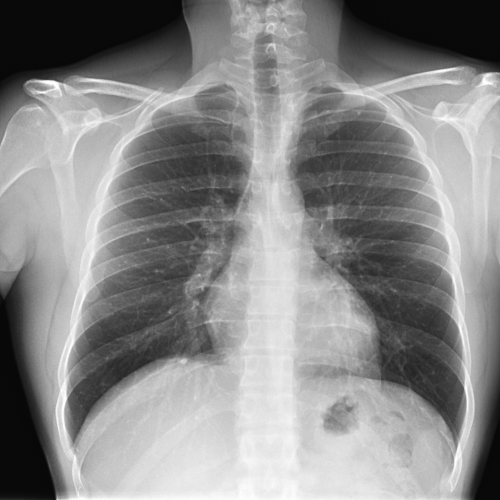

# Rx Torace PA (Postero-Anterior)

  📷 Radiografie Convențională (Rx)
  <strong>Actualizat:</strong> 2026-09-13
  <strong>Autor:</strong> Departamentul de Radiologie

---

-   __1. Rezumat Clinic & Indicații__

    ---

    === "Indicații Clinice"

        - Suspiciune infecție respiratorie joasă (pneumonie, bronhopneumonie)
        - Dispnee acută sau cronică neclară
        - Bilanț inițial hemoptizie sau tuse persistentă (> 3 săptămâni)
        - Suspiciune revărsat pleural sau pneumotorax (în ortostatism)
        - Evaluare cardiomegalie și congestie vasculară pulmonară
        - Traumatism toracic minor fără criterii de politraumă

    === "Ghid Național IRIS"

        !!! info "Referință Primară: Ghidul Național IRIS (Ordinul MS 1342/2012)"
            - **Capitol Ghid IRIS:** *Torace & Pulmon*
            - **Grad de Recomandare:** **Grad A**
            - **Nivel de Iradiere Estimată:** `Clasa 1 (Minimă < 0.05 mSv)`

            [:octicons-search-16: Deschide Ghidul IRIS](../../iris.md){ .md-button .md-button--primary } [:material-open-in-new: Aplicația Oficială PWA](https://radiologie-pediatrica.ro/iris/){ .md-button target="_blank" rel="noopener" }
-   __2. Poziționare & Centrare Fascicul__

    ---

    - **Poziție Pacient:** Ortostatism cu fața anterioară a toracelui lipită de stativul Bucky vertical, mâinile pe șolduri, umerii împinși înainte pentru degajarea omoplaților
    - **Punct de Centrare Fascicul:** Linia mediană posterioară, la nivelul unghiului inferior al omoplaților (T7)
    - **Distanță Focar-Film (DFF / SID):** 180 cm (reducerea magnificării siluetei cardiace)
    - **Comandă Respiratorie:** Apnee în inspir profund susținut (după a doua inspirație)

-   __3. Parametri Tehnici Expunere__

    ---

    | Parametru Tehnic | Valoare Configurare Generator / Tub |
    |:-----------------|:-------------------------------------|
    | **Tensiune Tub (kV)** | 120 - 125 kV |
    | **Sarcină / Produs Curent-Timp (mAs)** | 1.5 - 3 (AEC) |
    | **Distanță Focar-Film (DFF / SID)** | 180 cm (reducerea magnificării siluetei cardiace) |
    | **Grilă Antidifuzoare (Bucky)** | Cu grilă antidifuzoare Bucky (raport 10:1 sau 12:1) |
    | **Dimensiune Focar** | Focar Mare (1.0 - 1.2 mm) |
    | **Camere de Ionizare AEC** | Camerele laterale (dreapta și stânga) activate |
    | **Colimare Fascicul** | Superior la nivelul cartilajului tiroidian; inferior sub arcurile costale inferioare |
    | **Filtrare Tub** | Totală ≥ 2.5 mm Al echivalent |

-   __4. Criterii de Calitate & Reușită Imagine__

    ---

    - Vizualizarea completă a câmpurilor pulmonare: de la apexuri până la unghiurile costodiafragmatice
    - Inspir adecvat: minim 9-10 arcuri costale posterioare vizibile deasupra cupolelor diafragmatice
    - Absența rotației: capetele mediale ale claviculelor sunt echidistante față de apofizele spinoase
    - Omoplații sunt proiectați complet în afara ariei pulmonare
    - Penetrare optimă: conturul coloanei toracale și al vaselor retrocardiace sunt perceptibile

-   __5. Protecție Radiologică (ALARA)__

    ---

    - Șorț de plumb protector poziționat pe abdomen și pelvis (fără a masca sinusurile costo-frenice)
    - Colimare strictă conform principiului ALARA
    - La pacientele de vârstă fertilă se verifică absența sarcinii (regula de 10 zile)

!!! note "Observații Clinice & Tehnice"
    În suspiciune de pneumotorax mic sau corp străin bronșic, se poate solicita suplimentar un clișeu în expir forțat.

### 🖼️ Imagini

<figure class="protocol-image-card" markdown>

</figure>

=== "Ghid Rapid de Execuție"

    1. **Identificarea și verificarea pacientului:** verificare identitate, zonă de examinat, semnătură consimțământ și absență sarcină la pacientele de vârstă fertilă.
    2. **Pregătire:** îndepărtarea oricăror obiecte radiopace (bijuterii, agrafe, fermoare, proteze, pansamente dense).
    3. **Poziționare precisă:** alinierea receptorului de imagine și a tubului la distanța prescrisă (180 cm (reducerea magnificării siluetei cardiace)).
    4. **Colimare strictă:** adaptarea fasciculului strict la regiunea de diagnostic pentru scăderea iradierii și reducerea radiației difuze.
    5. **Protecție gonade/tiroidă:** aplicarea ecranului de plumb conform recomandărilor de radioprotecție.

## Surse și revizuire

- [Comisia Europeană (EUR 16260) — Criterii de calitate în radiodiagnostic](https://op.europa.eu/en/publication-detail/-/publication/d3d77212-5290-414e-8e37-27fde43b5925) — *Comisia Europeană* (UE)
- [ACR-SPR Practice Parameter for General Radiography (Digital Radiography)](https://www.acr.org/-/media/ACR/Files/Practice-Parameters/GeneralRad.pdf) — *ACR* (US)
- [Radiopaedia — X-ray Positioning and Projections Reference](https://radiopaedia.org/articles/x-ray-positioning-and-projections-1) — *Radiopaedia* (Internațional)
