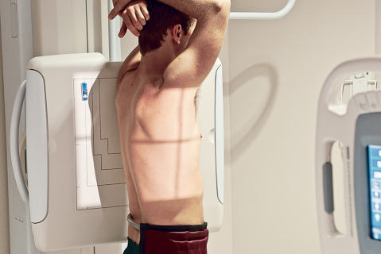
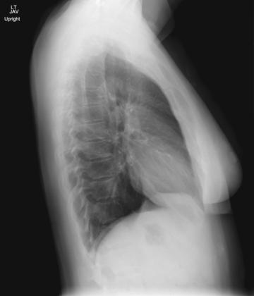
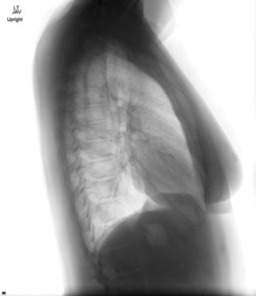

# Rx Torace Profil (Lateral) (Pacient Mobil / Cooperant (Ortostatism))

  📷 Radiografie Convențională (Rx)
  <strong>Actualizat:</strong> 2026-09-15
  <strong>Autor:</strong> Departamentul de Radiologie / Referință Bontrager

---

-   __1. Rezumat Clinic & Indicații__

    ---

    === "Indicații Clinice"

        - A 90degree perspective from Incidență Postero-Anterioară (PA) may demonstrate pathology situated posterior to the heart, great vessels, and Stern.

    === "Ghid Național IRIS"

        !!! info "Referință Primară: Ghidul Național IRIS (Ordinul MS 1342/2012)"
            - **Capitol Ghid IRIS:** *Ghidul Național IRIS*
            - **Grad de Recomandare:** **De verificat pe indicație; fără grad atribuit automat**
            - **Nivel de Iradiere Estimată:** `De verificat pentru examinarea și populația selectate`

            [:octicons-search-16: Deschide Ghidul IRIS](../../iris.md){ .md-button .md-button--primary } [:material-open-in-new: Aplicația Oficială PWA](https://radiologie-pediatrica.ro/iris/){ .md-button target="_blank" rel="noopener" }
-   __2. Poziționare & Centrare Fascicul__

    ---

    - **Poziție Pacient:** Pacient: Patient Ortostatism, left side against IR unless patient complaint involves right side (in that case, do a right lateral if departmental protocol includes this option) Weight evenly distributed on both feet Arms raised above head, chin up; Regiune anatomică: Center patient to CR and to IR anteriorly and posteriorly (Fig. 2.58). Position in a true Incidență de Profil (Lateral) (coronal plane is perpendicular and sagittal plane is parallel to IR; see NOTE 1). Lower CR and IR slightly from PA if needed (see NOTE 2).
    - **Punct de Centrare Fascicul:** perpendicular, directed to midthorax at level of T7 (3 to 4 inches [7.5 to 10 cm] below level of incizura jugulară (manubriul sternal))
    - **Distanță Focar-Film (DFF / SID):** 180 cm
    - **Comandă Respiratorie:** Apnee în inspir profund complet (după a doua inspirație).

-   __3. Parametri Tehnici Expunere__

    ---

    | Parametru Tehnic | Valoare Configurare Generator / Tub |
    |:-----------------|:-------------------------------------|
    | **Tensiune Tub (kV)** | 110-125 kV |
    | **Sarcină / Produs Curent-Timp (mAs)** | DE CONFIGURAT PE APARAT |
    | **Distanță Focar-Film (DFF / SID)** | 180 cm |
    | **Grilă Antidifuzoare (Bucky)** | Cu grilă antidifuzoare Bucky |
    | **Dimensiune Focar** | Focar Mare (1.0 - 1.2 mm) |
    | **Camere de Ionizare AEC** | Camerele laterale (sau camera centrală funcție de regiune) |
    | **Colimare Fascicul** | Collimate on four sides to area of lung fields (top border of light field to level of vertebra proeminentă (apofiza spinoasă C7)). |
    | **Filtrare Tub** | Totală ≥ 2.5 mm Al echivalent |

-   __4. Criterii de Calitate & Reușită Imagine__

    ---

    - Included are the entire lungs from apices to the costophrenic angles and from the Stern anteriorly to the posterior Coaste (Grilaj Costal) and thorax posteriorly (Figs. 2.59 and 2.60). Position
    - Chin and arms elevated sufficiently to prevent excessive soft tissues from superimposing apices.
    - Absența rotației anatomice: clavicule echidistante față de linia apofizelor spinoase: Posterior Coaste (Grilaj Costal) and costophrenic angle on side away from IR projected slightly (¼ to ½ inch [or about 1 cm] posterior because of divergent rays).
    - The hilar region should be in the approximate center of the IR.

-   __5. Protecție Radiologică (ALARA)__

    ---

    - Ecranare gonadică și a organelor radiosensibile conform procedurilor locale de radioprotecție ALARA.
    - Colimare strictă la aria de interes pentru limitarea radiației difuze.
    - Verificarea posibilității unei sarcini la pacientele de vârstă fertilă înainte de expunere.

!!! note "Observații Clinice & Tehnice"
    To determine direction of rotation and critique radiographs. Exposure No motion, as evidenced by sharp outlines of the diaphragm and lung markings. Optimal image receptor exposure with sufficient exposure and longscale contrast for visualization of rib outlines and lung markings through the heart shadow and upper lung areas without overexposing other regions of the lungs.

### 🖼️ Imagini

<figure class="protocol-image-card" markdown>

<figcaption><strong>Fig. 2.58 Left lateral Torace position.</strong> — Poziționare pacient conform Ghidului Bontrager (Fig. 2.58 Left lateral chest position.)</figcaption>

</figure>

<figure class="protocol-image-card" markdown>

<figcaption><strong>Fig. 2.59 Left lateral Torace.</strong> — Aspect radiografic de referință conform Ghidului Bontrager (Fig. 2.59 Left lateral chest.)</figcaption>

</figure>

<figure class="protocol-image-card" markdown>

<figcaption><strong>Fig. 2.60 Lateral Torace.</strong> — Aspect radiografic de referință conform Ghidului Bontrager (Fig. 2.60 Lateral chest.)</figcaption>

</figure>

=== "Ghid Rapid de Execuție"

    1. **Identificarea și verificarea pacientului:** verificare identitate, zonă de examinat, consimțământ conform procedurii și evaluarea posibilității unei sarcini, când este relevantă.
    2. **Pregătire:** îndepărtarea oricăror obiecte radiopace (bijuterii, agrafe, fermoare, proteze, pansamente dense).
    3. **Poziționare precisă:** alinierea receptorului de imagine și a tubului la distanța prescrisă (180 cm).
    4. **Colimare strictă:** adaptarea fasciculului strict la regiunea de diagnostic pentru scăderea iradierii și reducerea radiației difuze.
    5. **Radioprotecție:** verificarea [politicii RX](../radioprotectie.md), cu măsuri distincte pentru pacient, personal și însoțitor.

## Surse de documentare

- [Bontrager's Textbook of Radiographic Positioning (Ed. 9/10), Pagina 104](https://www.elsevier.com/books/textbook-of-radiographic-positioning-and-related-anatomy/lampignano/978-0-323-65367-1)
