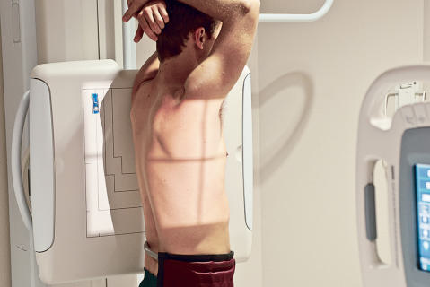
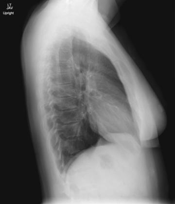
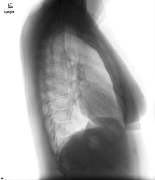

# Radiografie toracică de profil (lateral) (pacient mobil / cooperant (ortostatism))

  📷 Radiografie Convențională (Rx)
  <strong>Actualizat:</strong> 2026-09-15
  <strong>Autor:</strong> Departamentul de Radiologie / Referință Bontrager

---

-   __1. Rezumat Clinic & Indicații__

    ---

    === "Indicații Clinice"

        - O perspectivă la 90 de grade de la incidența postero-anterioară (PA) poate evidenția patologia situată posterior de cord, vasele mari și stern.

    === "Ghid Național IRIS"

        !!! info "Referință Primară: Ghidul Național IRIS (Ordinul MS 1342/2012)"
            - **Capitol Ghid IRIS:** *Torace & Pulmon*
            - **Grad de Recomandare:** **Grad A**
            - **Nivel de Iradiere Estimată:** `Clasa 1 (Minimă < 0.1 mSv)`

            [:octicons-search-16: Deschide Ghidul IRIS](../../iris.md){ .md-button .md-button--primary } [:material-open-in-new: Aplicația Oficială PWA](https://radiologie-pediatrica.ro/iris/){ .md-button target="_blank" rel="noopener" }

-   __2. Poziționare & Centrare Fascicul__

    ---

    - **Poziție Pacient:** Pacient: în ortostatism, cu partea stângă lipită de receptorul de imagine, cu excepția cazului în care acuzele pacientului implică partea dreaptă (în acest caz, se efectuează profilul drept dacă protocolul departamentului include această opțiune). Greutatea este distribuită uniform pe ambele picioare, brațele sunt ridicate deasupra capului, bărbia sus; regiune anatomică: se centrează pacientul, în sens antero-posterior, pe raza centrală și pe receptorul de imagine (Fig. 2.58). Poziție în incidență de profil adevărat (planul coronal este perpendicular, iar planul sagital este paralel cu receptorul de imagine; vezi NOTA 1). Se coboară raza centrală și receptorul de imagine ușor față de PA dacă este necesar (vezi NOTA 2).
    - **Punct de Centrare Fascicul:** Perpendicular, orientat la mediotorace la nivelul T7 (3 la 4 țoli [7.5 la 10 cm] sub nivelul incizurii jugulare (manubriul sternal))
    - **Distanță Focar-Film (DFF / SID):** 180 cm
    - **Comandă Respiratorie:** Apnee în inspir profund complet (după a doua inspirație).

-   __3. Parametri Tehnici Expunere__

    ---

    | Parametru Tehnic | Valoare Configurare Generator / Tub |
    |:-----------------|:-------------------------------------|
    | **Tensiune Tub (kV)** | 110-125 kV |
    | **Sarcină / Produs Curent-Timp (mAs)** | DE CONFIGURAT PE APARAT |
    | **Distanță Focar-Film (DFF / SID)** | 180 cm |
    | **Grilă Antidifuzoare (Bucky)** | Cu grilă antidifuzoare Bucky |
    | **Dimensiune Focar** | Focar Mare (1.0 - 1.2 mm) |
    | **Camere de Ionizare AEC** | Camerele laterale (sau camera centrală, în funcție de regiune) |
    | **Colimare Fascicul** | Colimați pe cele patru laturi la zona câmpurilor pulmonare (marginea superioară a câmpului luminos la nivelul vertebrei proeminente, apofiza spinoasă C7). |
    | **Filtrare Tub** | Totală ≥ 2.5 mm Al echivalent |

-   __4. Criterii de Calitate & Reușită Imagine__

    ---

    - Sunt incluși plămânii în întregime, de la apexuri (vârfuri pulmonare) la sinusurile costodiafragmatice și de la stern anterior până la coastele posterioare (grilajul costal) și toracele posterior (Fig. 2.59 și 2.60). Poziție
    - Bărbia și brațele ridicate suficient pentru a preveni suprapunerea excesului de țesuturi moi peste apexuri (vârfurile pulmonare).
    - Absența rotației anatomice: claviculele echidistante față de linia apofizelor spinoase; coastele posterioare (grilajul costal) și sinusurile costodiafragmatice de pe partea îndepărtată de receptorul de imagine sunt proiectate ușor posterior (¼ la ½ țol [sau aproximativ 1 cm] posterior din cauza razelor divergente).
    - Regiunea hilară trebuie să fie în centrul aproximativ al receptorului de imagine.

-   __5. Protecție Radiologică (ALARA)__

    ---

    - Ecranare gonadică și a organelor radiosensibile conform procedurilor locale de radioprotecție ALARA.
    - Colimare strictă la aria de interes pentru limitarea radiației difuze.
    - Verificarea posibilității unei sarcini la pacientele de vârstă fertilă înainte de expunere.

!!! note "Observații Clinice & Tehnice"
    pentru a determina direcția rotației și a evalua critic radiografiile. Expunere fără mișcare, evidențiată prin contururi clare ale cupolelor diafragmatice și marcajelor pulmonare. Expunere optimă a receptorului de imagine, cu expunere suficientă și contrast pe scară lungă pentru vizualizarea contururilor costale și a marcajelor pulmonare prin umbra cordului și ariile pulmonare superioare fără supraexpunerea altor regiuni ale plămânilor.

### 🖼️ Imagini

<figure class="protocol-image-card" markdown>

<figcaption><strong>Fig. 2.58 Poziție toracică de profil stâng.</strong> — Poziționarea pacientului conform Ghidului Bontrager (Fig. 2.58 poziție toracică de profil stâng.)</figcaption>

</figure>

<figure class="protocol-image-card" markdown>

<figcaption><strong>Fig. 2.59 Torace de profil stâng.</strong> — Aspect radiografic de referință conform Ghidului Bontrager (Fig. 2.59 torace de profil stâng.)</figcaption>

</figure>

<figure class="protocol-image-card" markdown>

<figcaption><strong>Fig. 2.60 Torace de profil.</strong> — Aspect radiografic de referință conform Ghidului Bontrager (Fig. 2.60 torace de profil.)</figcaption>

</figure>

=== "Ghid Rapid de Execuție"

    1. **Identificarea și verificarea pacientului:** verificare identitate, zonă de examinat, consimțământ conform procedurii și evaluarea posibilității unei sarcini, când este relevantă.
    2. **Pregătire:** îndepărtarea oricăror obiecte radiopace (bijuterii, agrafe, fermoare, proteze, pansamente dense).
    3. **Poziționare precisă:** alinierea receptorului de imagine și a tubului la distanța prescrisă (180 cm).
    4. **Colimare strictă:** adaptarea fasciculului strict la regiunea de diagnostic pentru scăderea iradierii și reducerea radiației difuze.
    5. **Radioprotecție:** verificarea [politicii RX](../radioprotectie.md), cu măsuri distincte pentru pacient, personal și însoțitor.

## Surse de documentare

- [Bontrager's Textbook of Radiographic Positioning (Ed. 9/10), Pagina 104](https://www.elsevier.com/books/textbook-of-radiographic-positioning-and-related-anatomy/lampignano/978-0-323-65367-1)
