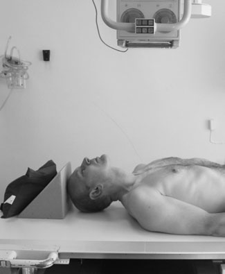
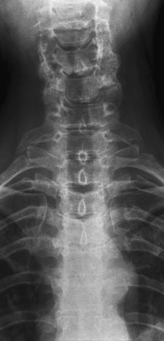
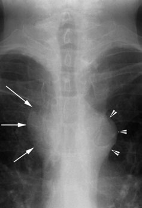
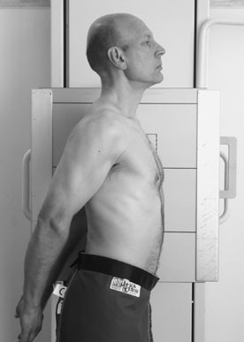
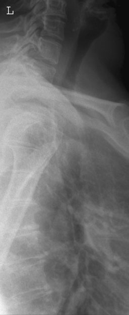
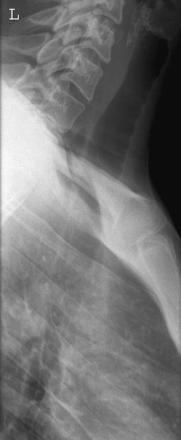

# Rx Trahee și Strâmtoare Toracică Superioară (including thoracic inlet) Antero-Posterior (AP)

  📷 Radiografie Convențională (Rx)
  <strong>Actualizat:</strong> 2026-09-16
  <strong>Autor:</strong> Departamentul de Radiologie / Referință Clark (Ed. 12)

---

-   __1. Rezumat Clinic & Indicații__

    ---

    === "Indicații Clinice"

        - This incidență este sometimes helpful în confirming retrosternal extension de thyroid gland. Most assessments de trachea itself will fie prin bronchoscopy și/sau CT (especially multislice CT cu MPR reconstructions și virtual bronchoscopy).
        - anterior mediastinal mass (e.g. retrosternal thyroid) causes increased densitate optică de anterior mediastinal window. This poate also fie mimicked prin superimposed părți moi if pacientul’s brațe sunt nu pulled backwards sufficiently away de la aria de interes diagnostic. Trachea 6th CV Profil (lateral) radiografie evidențiind normal air-filled trachea Profil (lateral) radiografie evidențiind compression și posterior deviation de trachea prin enlarged thyroid.

    === "Ghid Național IRIS"

        !!! info "Referință Primară: Ghidul Național IRIS (Ordinul MS 1342/2012)"
            - **Capitol Ghid IRIS:** *Ghidul Național IRIS*
            - **Grad de Recomandare:** **De verificat pe indicație; fără grad atribuit automat**
            - **Nivel de Iradiere Estimată:** `De verificat pentru examinarea și populația selectate`

            [:octicons-search-16: Deschide Ghidul IRIS](../../iris.md){ .md-button .md-button--primary } [:material-open-in-new: Aplicația Oficială PWA](https://radiologie-pediatrica.ro/iris/){ .md-button target="_blank" rel="noopener" }
-   __2. Poziționare & Centrare Fascicul__

    ---

    - **Poziție Pacient:** • pacientul este culcat Decubit dorsal, cu planul mediosagital ajustat la coincide cu central axa longitudinală de imaging couch.
• bărbia este raised la show soft tissues below Mandibulă și la bring radiographic baseline la angle de 20 grade de la vertical.
• caseta este centred la nivelul incizură jugulară (furculiță sternală).

• pacientul stă în ortostatism sau sits cu either Umăr against stativ vertical Bucky.
• planul mediosagital de trunk și cap sunt paralel cu casetă.
• caseta trebuie să fie large enough la include de la lower faringe la lower end de trachea la nivelul sternal angle.
• umerii sunt pulled well backwards la enable visualization de trachea.
• This poziție este aided prin pacientul clasping their mâini behind back și pulling their brațe backwards.
• caseta este centred la nivelul incizură jugulară (furculiță sternală).
    - **Punct de Centrare Fascicul:** • Direct vertical ray în linia mediană la nivelul incizură jugulară (furculiță sternală).
• expunere este made pe forced expiration.

• raza centrală orizontală centrală este orientat la caseta la nivelul incizură jugulară (furculiță sternală).
• expunere este made pe forced expiration.
    - **Distanță Focar-Film (DFF / SID):** 100 cm
    - **Comandă Respiratorie:** expunere este made pe forced expiration

-   __3. Parametri Tehnici Expunere__

    ---

    | Parametru Tehnic | Valoare Configurare Generator / Tub |
    |:-----------------|:-------------------------------------|
    | **Tensiune Tub (kV)** | DE CONFIGURAT PE APARAT |
    | **Sarcină / Produs Curent-Timp (mAs)** | Conform AEC / grosime anatomică |
    | **Distanță Focar-Film (DFF / SID)** | 100 cm |
    | **Grilă Antidifuzoare (Bucky)** | Cu grilă antidifuzoare Bucky |
    | **Dimensiune Focar** | Focar Mic (0.6 mm) |
    | **Camere de Ionizare AEC** | Camerele laterale (sau camera centrală funcție de regiune) |
    | **Colimare Fascicul** | Colimare strictă la aria anatomică de interes diagnostic |
    | **Filtrare Tub** | Totală ≥ 2.5 mm Al echivalent (conform Clark: 3.0 mm Al eq.) |

-   __4. Criterii de Calitate & Reușită Imagine__

    ---

    - fascicul trebuie să fie collimated pentru include full length de trachea. 196 Antero-posterior (AP) radiografie evidențiind normal trachea Antero-posterior (AP) radiografie de trachea evidențiind paratracheal lymph node mass (arrows). arrowheads indicate aortic arch

-   __5. Protecție Radiologică (ALARA)__

    ---

    - Ecranare gonadică cu șorț plumbat dacă gonadele sunt în apropierea fasciculului util (regula ALARA).
    - Colimare precisă la dimensiunea anatomică strict necesară pentru reducerea dozei și a radiației difuze.
    - Verificarea posibilității unei sarcini la pacientele de vârstă fertilă înainte de expunere.

!!! note "Observații Clinice & Tehnice"
    la ideal poziție și humeral heads just overlap trachea

### 🖼️ Imagini

<figure class="protocol-image-card" markdown>

<figcaption><strong>Plain radiografie este requested la investigate presence de</strong> — Poziționare pacient și centrare fascicul conform Clark (Ed. 12)</figcaption>

</figure>

<figure class="protocol-image-card" markdown>

<figcaption><strong>și la bring radiographic baseline la angle de 20 grade</strong> — Aspect radiografic / ghid de poziționare conform tratatului Clark (Ed. 12)</figcaption>

</figure>

<figure class="protocol-image-card" markdown>

<figcaption><strong>Antero-posterior (AP) radiografie evidențiind normal trachea</strong> — Aspect radiografic / ghid de poziționare conform tratatului Clark (Ed. 12)</figcaption>

</figure>

<figure class="protocol-image-card" markdown>

<figcaption><strong>Profil (lateral) radiografie evidențiind normal</strong> — Aspect radiografic / ghid de poziționare conform tratatului Clark (Ed. 12)</figcaption>

</figure>

<figure class="protocol-image-card" markdown>

<figcaption><strong>Profil (lateral) radiografie evidențiind</strong> — Aspect radiografic / ghid de poziționare conform tratatului Clark (Ed. 12)</figcaption>

</figure>

<figure class="protocol-image-card" markdown>

<figcaption><strong>Figura 6: Aspect radiografic / Poziționare (Clark Ed. 12)</strong> — Aspect radiografic / ghid de poziționare conform tratatului Clark (Ed. 12)</figcaption>

</figure>

=== "Ghid Rapid de Execuție"

    1. **Identificarea și verificarea pacientului:** verificare identitate, zonă de examinat, consimțământ conform procedurii și evaluarea posibilității unei sarcini, când este relevantă.
    2. **Pregătire:** îndepărtarea oricăror obiecte radiopace (bijuterii, agrafe, fermoare, proteze, pansamente dense).
    3. **Poziționare precisă:** alinierea receptorului de imagine și a tubului la distanța prescrisă (100 cm).
    4. **Colimare strictă:** adaptarea fasciculului strict la regiunea de diagnostic pentru scăderea iradierii și reducerea radiației difuze.
    5. **Radioprotecție:** verificarea [politicii RX](../radioprotectie.md), cu măsuri distincte pentru pacient, personal și însoțitor.

## Surse de documentare

- [Clark's Positioning in Radiography (Ed. 12), Pagina 211](../../assets/protocols/sources/Clark___Positioning_in_Radiography__12th_edition.pdf#page=211)
