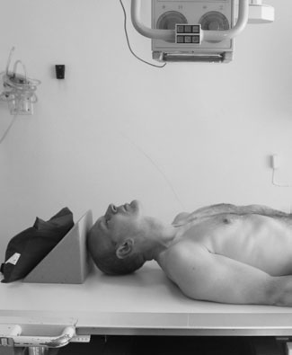
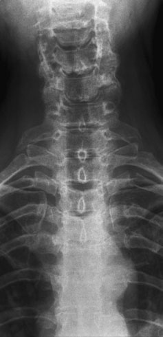
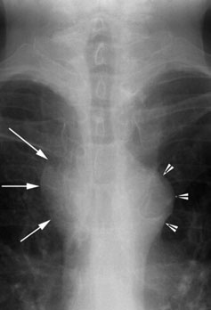
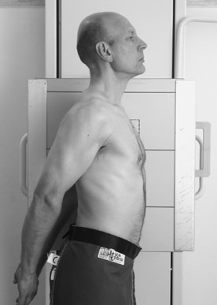
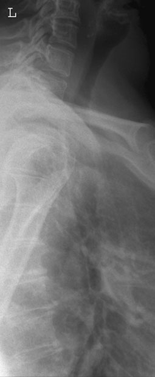
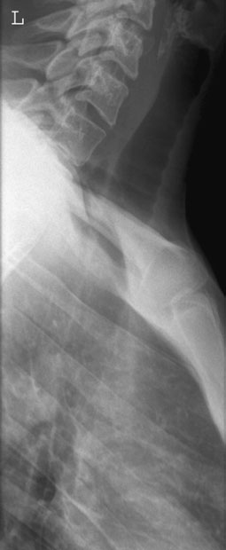

# Radiografie antero-posterioară (AP) a traheei și a strâmtorii toracice superioare (incluzând apertura toracică superioară)

  📷 Radiografie Convențională (Rx)
  <strong>Actualizat:</strong> 2026-09-16
  <strong>Autor:</strong> Departamentul de Radiologie / Referință Clark (Ed. 12)

---

-   __1. Rezumat Clinic & Indicații__

    ---

    === "Indicații Clinice"

        - Această incidență este uneori utilă pentru confirmarea extensiei retrosternale a glandei tiroide. Majoritatea evaluărilor traheei propriu-zise se efectuează prin bronhoscopie și/sau CT (în special CT multislice cu reconstrucții MPR și bronhoscopie virtuală).
        - O masă mediastinală anterioară (de exemplu, tiroidă retrosternală) determină creșterea densității optice a ferestrei mediastinale anterioare. Aceasta poate fi mimată și de țesuturi moi suprapuse dacă brațele pacientului nu sunt retrase suficient în afara ariei de interes diagnostic. Trahee la nivelul celei de-a 6-a vertebre cervicale. Radiografie de profil evidențiind trahee normală umplută cu aer. Radiografie de profil evidențiind compresia și deviația posterioară a traheei de către tiroida mărită.

    === "Ghid Național IRIS"

        !!! info "Referință Primară: Ghidul Național IRIS (Ordinul MS 1342/2012)"
            - **Capitol Ghid IRIS:** *Torace & Pulmon*
            - **Grad de Recomandare:** **Grad A**
            - **Nivel de Iradiere Estimată:** `Clasa 1 (Minimă < 0.1 mSv)`

            [:octicons-search-16: Deschide Ghidul IRIS](../../iris.md){ .md-button .md-button--primary } [:material-open-in-new: Aplicația Oficială PWA](https://radiologie-pediatrica.ro/iris/){ .md-button target="_blank" rel="noopener" }

-   __2. Poziționare & Centrare Fascicul__

    ---

    - **Poziție Pacient:**
        - Pacientul este culcat în decubit dorsal, cu planul mediosagital ajustat să coincidă cu axa longitudinală centrală a mesei de examinare.
        - Bărbia este ridicată pentru a evidenția țesuturile moi de sub mandibulă și pentru a aduce linia de bază radiografică la un unghi de 20 grade față de verticală.
        - Caseta este centrată la nivelul incizurii jugulare (furculița sternală).
        - Pacientul stă în ortostatism sau șezând, cu un umăr lipit de stativul vertical Bucky.
        - Planul mediosagital al trunchiului și capului este paralel cu caseta.
        - Caseta trebuie să fie suficient de mare pentru a include de la faringele inferior până la capătul inferior al traheei, la nivelul unghiului sternal.
        - Umerii sunt trași bine posterior pentru a permite vizualizarea traheei.
        - Această poziție este facilitată prin faptul că pacientul își ține mâinile împreunate în spatele spatelui și își trage brațele posterior.
        - Caseta este centrată la nivelul incizurii jugulare (furculița sternală).
    - **Punct de Centrare Fascicul:**
        - Raza verticală directă în linia mediană la nivelul incizurii jugulare (furculița sternală).
        - Expunerea se efectuează în expir forțat.
        - Raza centrală orizontală este orientată spre casetă la nivelul incizurii jugulare (furculița sternală).
        - Expunerea se efectuează în expir forțat.
    - **Distanță Focar-Film (DFF / SID):** 100 cm
    - **Comandă Respiratorie:** Expunerea se efectuează în expir forțat.

-   __3. Parametri Tehnici Expunere__

    ---

    | Parametru Tehnic | Valoare Configurare Generator / Tub |
    |:-----------------|:-------------------------------------|
    | **Tensiune Tub (kV)** | DE CONFIGURAT PE APARAT |
    | **Sarcină / Produs Curent-Timp (mAs)** | Conform AEC / grosimii anatomice |
    | **Distanță Focar-Film (DFF / SID)** | 100 cm |
    | **Grilă Antidifuzoare (Bucky)** | Cu grilă antidifuzoare Bucky |
    | **Dimensiune Focar** | Focar Mic (0.6 mm) |
    | **Camere de Ionizare AEC** | Camerele laterale (sau camera centrală, în funcție de regiune) |
    | **Colimare Fascicul** | Colimare strictă la aria anatomică de interes diagnostic |
    | **Filtrare Tub** | Totală ≥ 2.5 mm Al echivalent (conform Clark: 3.0 mm Al echivalent) |

-   __4. Criterii de Calitate & Reușită Imagine__

    ---

    - Fasciculul trebuie colimat pentru a include întreaga lungime a traheei. 196 Radiografie antero-posterioară (AP) evidențiind trahee normală. Radiografie antero-posterioară (AP) a traheei evidențiind o masă ganglionară paratraheală (săgeți). Vârfurile săgeților indică arcul aortic

-   __5. Protecție Radiologică (ALARA)__

    ---

    - Ecranare gonadică cu șorț plumbat dacă gonadele sunt în apropierea fasciculului util (regula ALARA).
    - Colimare precisă la dimensiunea anatomică strict necesară pentru reducerea dozei și a radiației difuze.
    - Verificarea posibilității unei sarcini la pacientele de vârstă fertilă înainte de expunere.

!!! note "Observații Clinice & Tehnice"
    În poziția ideală, capetele humerale se suprapun ușor peste trahee

### 🖼️ Imagini

<figure class="protocol-image-card" markdown>

<figcaption><strong>Radiografia simplă este solicitată pentru investigarea prezenței</strong> — Poziționarea pacientului și centrarea fasciculului conform Clark (Ed. 12)</figcaption>

</figure>

<figure class="protocol-image-card" markdown>

<figcaption><strong>și pentru a aduce linia de bază radiografică la un unghi de 20 grade</strong> — Aspect radiografic / ghid de poziționare conform tratatului Clark (Ed. 12)</figcaption>

</figure>

<figure class="protocol-image-card" markdown>

<figcaption><strong>Radiografie antero-posterioară (AP) evidențiind trahee normală</strong> — Aspect radiografic / ghid de poziționare conform tratatului Clark (Ed. 12)</figcaption>

</figure>

<figure class="protocol-image-card" markdown>

<figcaption><strong>Radiografie de profil (lateral) evidențiind normal</strong> — Aspect radiografic / ghid de poziționare conform tratatului Clark (Ed. 12)</figcaption>

</figure>

<figure class="protocol-image-card" markdown>

<figcaption><strong>Radiografie de profil (lateral) evidențiind</strong> — Aspect radiografic / ghid de poziționare conform tratatului Clark (Ed. 12)</figcaption>

</figure>

<figure class="protocol-image-card" markdown>

<figcaption><strong>Figura 6: Aspect radiografic / Poziționare (Clark Ed. 12)</strong> — Aspect radiografic / ghid de poziționare conform tratatului Clark (Ed. 12)</figcaption>

</figure>

=== "Ghid Rapid de Execuție"

    1. **Identificarea și verificarea pacientului:** verificare identitate, zonă de examinat, consimțământ conform procedurii și evaluarea posibilității unei sarcini, când este relevantă.
    2. **Pregătire:** îndepărtarea oricăror obiecte radiopace (bijuterii, agrafe, fermoare, proteze, pansamente dense).
    3. **Poziționare precisă:** alinierea receptorului de imagine și a tubului la distanța prescrisă (100 cm).
    4. **Colimare strictă:** adaptarea fasciculului strict la regiunea de diagnostic pentru scăderea iradierii și reducerea radiației difuze.
    5. **Radioprotecție:** verificarea [politicii RX](../radioprotectie.md), cu măsuri distincte pentru pacient, personal și însoțitor.

## Surse de documentare

- [Clark's Positioning in Radiography (Ed. 12), Pagina 211](https://books.google.com/books/about/Clark_s_Positioning_in_Radiography.html?id=Xxu6MwEACAAJ)
