# Rx ▪ Incidență cu Compresie Focalizată — Incidență Tangențială (TAN) (Merrill)

  📷 Radiografie Convențională (Rx)
  <strong>Actualizat:</strong> 2026-09-16
  <strong>Autor:</strong> Referință Merrill

---

-   __1. Rezumat Clinic & Indicații__

    ---

    === "Indicații Clinice"

        - Conform reperelor anatomice standard din tratat

    === "Ghid Național IRIS"

        !!! info "Referință Primară: Ghidul Național IRIS (Ordinul MS 1342/2012)"
            - **Capitol Ghid IRIS:** *Ghidul Național IRIS*
            - **Grad de Recomandare:** **De verificat pe indicație; fără grad atribuit automat**
            - **Nivel de Iradiere Estimată:** `De verificat pentru examinarea și populația selectate`

            [:octicons-search-16: Deschide Ghidul IRIS](../../iris.md){ .md-button .md-button--primary } [:material-open-in-new: Aplicația Oficială PWA](https://radiologie-pediatrica.ro/iris/){ .md-button target="_blank" rel="noopener" }
-   __2. Poziționare & Centrare Fascicul__

    ---

    - **Poziție Pacient:** Se instruiește pacientul să stand facing receptorul de imagine sau se așază pacientul pe scaun pe adjustable stool facing unit. Se instruiește pacientul să stand facing receptorul de imagine sau se așază pacientul pe scaun pe adjustable stool facing unit. Se instruiește pacientul să stand facing receptorul de imagine. Se instruiește pacientul să stand facing receptorul de imagine sau se așază pacientul pe scaun pe adjustable stool facing unit. Se instruiește pacientul să stand facing receptorul de imagine sau se așază pacientul pe scaun pe adjustable stool facing unit.; pentru palpable mass TAN incidență este most often performed cu use de magnification technique. Select standard, quadrant, sau spot compression paddle, ca appropriate. Place AEC detector la Torace perete. Locate aria de interes diagnostic prin palpating pacientul’s Mamografie (Sân). Place radiopaque marker sau BB pe mass, sau Se instruiește pacientul să place BB pe area de concern. Using imaginary line între nipple și BB ca angle reference (Fig. 18.58), se rotește C-braț apparatus paralel la this line. raza centrală este orientat tangențial pe Mamografie (Sân) la point identified prin BB marker. Place Mamografie (Sân) pe receptorul de imagine sau magnification stand cu aria de interes diagnostic marked prin BB pe edge de skin. “shadow” de BB will fie projected onto receptorul de imagine surface. Using appropriate compression paddle, compress Mamografie (Sân) while ensuring that enough Mamografie (Sân) tissue covers AEC detector area. Se aplică progresiv compresia până când glanda mamară este ferm fixată. Se instruiește pacientul să indicate if compression becomes uncomfortable. When full compression este achieved, Se instruiește pacientul să stop respirație (Figs. 18.59 și 18.60). Se declanșează expunerea. Se decomprimă sânul imediat după efectuarea expunerii. Place magnification platform designed pentru use cu dedicated Mamografie unit pe equipment. Place lead BB over palpable mass. Using your mâini, determine incidență most likely la imagine lump cu fără superimposition de other tissue. Place area de clinical concern la edge de Mamografie (Sân) în tangent plane la imaging plate. palpable area de clinical concern este captured cu corner de wire coat-hanger sau inverted spot compression device. fără additional compression este needed. It poate fie necessary la use manual technique if amount de tissue captured within coat-hanger sau inverted compression device does nu cover AEC detector. se rotește C-braț apparatus 180 grade de la rotație used pentru routine CC incidență. tubul cap will fie near floor și receptorul de imagine will fie above pacientul’s Mamografie (Sân). în ortostatism pe medial side de Mamografie (Sân) la fie imaged, elevate inframammary fold la its maximal height. se ajustează height de C-braț astfel încât receptorul de imagine este în contact cu superior Mamografie (Sân) tissue. Lean pacientul slightly forward while gently pulling ridicat Mamografie (Sân) out și perpendicular pe Torace perete. Hold Mamografie (Sân) în poziție. Se instruiește pacientul să rest afected braț over top de receptorul de imagine. Se informează pacienta cu privire la aplicarea compresiei pe glanda mamară. Bring compression paddle de la below into contact cu pacientul’s Mamografie (Sân) while sliding Mână spre nipple. Se aplică progresiv compresia până când glanda mamară este ferm fixată. Se instruiește pacientul să indicate if compression becomes uncomfortable. la ensure that pacientul’s Abdomen este nu superimposed over path de fascicul, Se instruiește pacientul să pull în abdomenul sau move șoldurile back slightly. When full compression este achieved, move AEC detector la appropriate poziție, și Se instruiește pacientul să stop respirație (Fig. 18.64). Se declanșează expunerea. Se decomprimă sânul imediat după efectuarea expunerii. Determine grade de obliquity de C-braț apparatus prin rotating tubul until long edge de receptorul de imagine este paralel cu la de afected side. grade de obliquity varies între 10 și 35 grade. se ajustează height de C-braț astfel încât superior margine de receptorul de imagine este just under axilla. Se instruiește pacientul să elevate braț de afected side over corner de receptorul de imagine și la rest Mână pe adjacent handgrip. pacientul’s Cot trebuie să fie flectat. Se instruiește pacientul să relax afected Umăr și lean it slightly anterior. Using flat surface de Mână, gently pull tail de Mamografie (Sân) anteriorly și medially onto receptorul de imagine, keeping skin și tissue smooth și liber de wrinkles. Se instruiește pacientul să turn capul away de la side being examined și la rest capul pe / sprijinit de face guard. Se informează pacienta cu privire la aplicarea compresiei pe glanda mamară. Continue la hold Mamografie (Sân) în poziție while sliding Mână spre nipple ca compression paddle este brought into contact cu la (Fig. 18.66). Se aplică progresiv compresia până când glanda mamară este ferm fixată. corner de compression paddle trebuie să fie inferior la Claviculă. la avoid pacient discomfort caused prin corner de paddle și la facilitate even compression, remind pacientul la keep Umăr relaxat. Se instruiește pacientul să indicate if compression becomes uncomfortable. When full compression este achieved, move AEC detector la appropriate poziție, și Se instruiește pacientul să stop respirație. It poate fie necessary la increase parametri de expunere if compression este nu ca taut ca în routine incidențe. Se declanșează expunerea. Se decomprimă sânul imediat după efectuarea expunerii. se rotește C-braț la approximately 70 grade. se ajustează height de C-braț astfel încât superior edge de receptorul de imagine este even cu top de pacientul’s Umăr. Select appropriate compression device. quadrant paddle will capture more deep axillary tissue; standard 18 × 24 cm compression paddle will capture additional lateral tissue și la. Se instruiește pacientul să elevate braț de afected side so that it este perpendicular pe corp. Place braț pe / sprijinit de receptorul de imagine astfel încât posterior aspect de Umăr este resting pe / sprijinit de receptorul de imagine. pacientul’s braț este draped across receptorul de imagine cu Antebraț resting pe grip bar. Se instruiește pacientul să relax afected Umăr și lean slightly anterior. Using flat surface de Mână plasat under axillary region, gently pull tail de Mamografie (Sân) anteriorly și medially onto receptorul de imagine, keeping skin și tissue smooth și liber de wrinkles. Se informează pacienta cu privire la aplicarea compresiei pe glanda mamară. Slowly bring compression down along pacientul’s Coaste (Grilaj Costal), cu top edge de compression paddle skimming lower edge de pacientul’s upper braț. Slowly apply compression until axillary tissue feels taut. corner de compression paddle trebuie să fie inferior la Claviculă. la avoid pacient discomfort caused prin corner de paddle și la facilitate even compression, remind pacientul la keep Umăr relaxat. Se instruiește pacientul să indicate if compression becomes uncomfortable. Vigorous compression este nu necessary pentru this incidență (Fig. 18.68). When full compression este achieved, move AEC detector la appropriate poziție, și Se instruiește pacientul să stop respirație. It poate fie necessary la increase parametri de expunere if compression este nu ca taut ca în routine incidențe. Se declanșează expunerea. Se decomprimă sânul imediat după efectuarea expunerii.
    - **Punct de Centrare Fascicul:** perpendicular pe aria de interes diagnostic perpendicular pe imaging plate. perpendicular pe base de Mamografie (Sân) perpendicular pe receptorul de imagine (RI) angle de C-braț apparatus este determined prin slope de pacientul’s la.
    - **Distanță Focar-Film (DFF / SID):** Nespecificat în fragmentul extras; de verificat în sursă
    - **Comandă Respiratorie:** Conform reperelor anatomice standard din tratat

-   __3. Parametri Tehnici Expunere__

    ---

    | Parametru Tehnic | Valoare Configurare Generator / Tub |
    |:-----------------|:-------------------------------------|
    | **Tensiune Tub (kV)** | DE CONFIGURAT PE APARAT |
    | **Sarcină / Produs Curent-Timp (mAs)** | DE CONFIGURAT PE APARAT |
    | **Distanță Focar-Film (DFF / SID)** | Nespecificat în fragmentul extras; de verificat în sursă |
    | **Grilă Antidifuzoare (Bucky)** | DE CONFIGURAT PE APARAT |
    | **Dimensiune Focar** | DE CONFIGURAT PE APARAT |
    | **Camere de Ionizare AEC** | DE CONFIGURAT PE APARAT |
    | **Colimare Fascicul** | Conform reperelor anatomice standard din tratat |
    | **Filtrare Tub** | DE CONFIGURAT PE APARAT |

-   __4. Criterii de Calitate & Reușită Imagine__

    ---

    - following trebuie să fie clearly vizualizat:
    - Palpable lesion visualized over subcutaneous fat
    - TAN radiopaque marker sau BB marker accurately correlated cu palpable lesion
    - Minimal overlapping de adjacent parenchyma
    - Calcification în parenchyma sau skin
    - Uniform tissue expunere if compression este adecvat following trebuie să fie clearly vizualizat:
    - aria de interes diagnostic within collimated și self-compressed margins following trebuie să fie clearly vizualizat:
    - superior Mamografie (Sân) tissue și lesions clearly visualized
    - pentru needle localization imagini, inferior lesion visualized within specialized fenestrated compression plate
    - pacient’s Abdomen projected clear de imagine
    - Inclusion de fixed posterior tissue de superior aspect de Mamografie (Sân)
    - PNL extending posteriorly la edge de imagine, measuring within ⅓ inch (1 cm) de depth de PNL pe MLO incidență
    - toate medial tissue included ca vizualizat prin visualization de medial retroglandular fat și absence de fibroglandular tissue extending la posteromedial edge de imagine
    - Nipple în profile, if possible, și la midline, indicating fără exaСeration de positioning
    - Some lateral tissue possibly excluded la emphasize medial tissue
    - Slight medial skin reflection la cleavage, ensuring that posterior medial tissue este adequately included
    - Uniform tissue expunere if compression este adecvat Mediolateral Incidență Oblică pentru Axillary Tail (la) Paddle: 8 × 10 inches (18 × 24 cm) sau 10 × 12 inches (24 × 30 cm). following trebuie să fie clearly vizualizat:
    - la cu inclusion de axillary lymph nodes under focal compression (Fig. 18.67)
    - Uniform tissue expunere if compression este adecvat
    - Slight skin reflection de afected braț pe superior margine de imagine following trebuie să fie clearly vizualizat:
    - la cu inclusion de axillary lymph nodes under focal compression (Fig. 18.69)
    - Uniform tissue expunere if compression este adecvat
    - Slight skin reflection de afected braț pe superior margine de imagine

-   __5. Protecție Radiologică (ALARA)__

    ---

    - Nespecificat în fragmentul extras; de verificat în sursă

!!! note "Observații Clinice & Tehnice"
    Conform reperelor anatomice standard din tratat

### 🖼️ Imagini

<figure class="protocol-image-card" markdown>

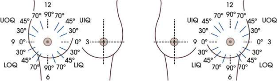

<figcaption><strong>Merrill — pagina PDF 1389, imaginea 1</strong> — Imagine din fragmentul sursă; asocierea necesită revizie.</figcaption>

</figure>

<figure class="protocol-image-card" markdown>

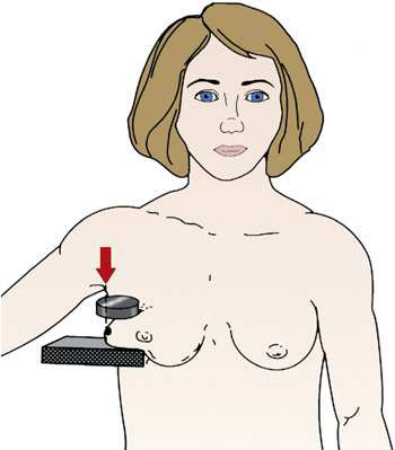

<figcaption><strong>Merrill — pagina PDF 1390, imaginea 2</strong> — Imagine din fragmentul sursă; asocierea necesită revizie.</figcaption>

</figure>

<figure class="protocol-image-card" markdown>

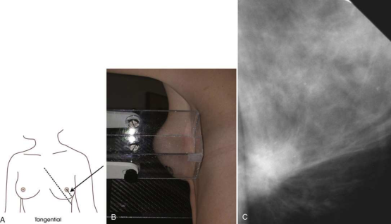

<figcaption><strong>Merrill — pagina PDF 1390, imaginea 3</strong> — Imagine din fragmentul sursă; asocierea necesită revizie.</figcaption>

</figure>

<figure class="protocol-image-card" markdown>

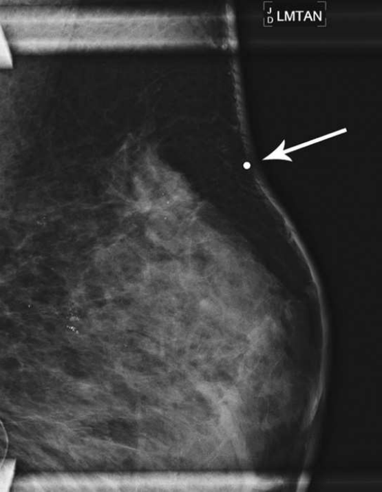

<figcaption><strong>Merrill — pagina PDF 1391, imaginea 4</strong> — Imagine din fragmentul sursă; asocierea necesită revizie.</figcaption>

</figure>

<figure class="protocol-image-card" markdown>

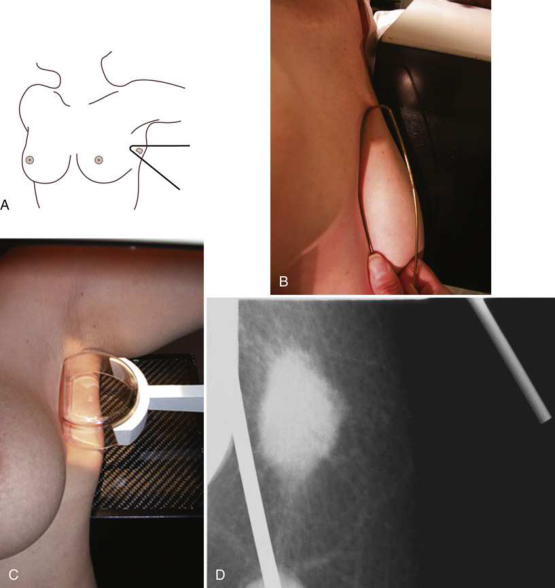

<figcaption><strong>Merrill — pagina PDF 1392, imaginea 5</strong> — Imagine din fragmentul sursă; asocierea necesită revizie.</figcaption>

</figure>

<figure class="protocol-image-card" markdown>

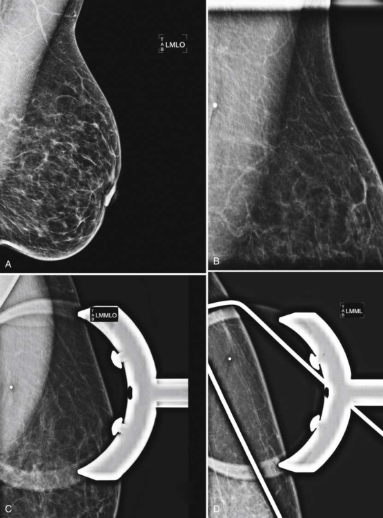

<figcaption><strong>Merrill — pagina PDF 1393, imaginea 6</strong> — Imagine din fragmentul sursă; asocierea necesită revizie.</figcaption>

</figure>

<figure class="protocol-image-card" markdown>

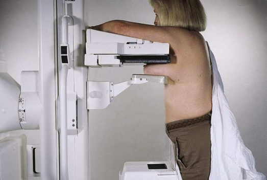

<figcaption><strong>Merrill — pagina PDF 1394, imaginea 7</strong> — Imagine din fragmentul sursă; asocierea necesită revizie.</figcaption>

</figure>

<figure class="protocol-image-card" markdown>

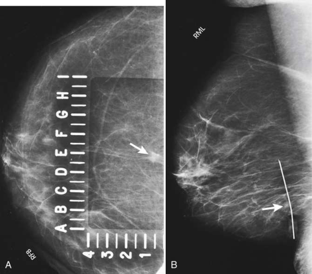

<figcaption><strong>Merrill — pagina PDF 1395, imaginea 8</strong> — Imagine din fragmentul sursă; asocierea necesită revizie.</figcaption>

</figure>

<figure class="protocol-image-card" markdown>

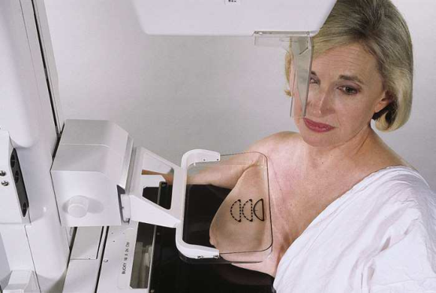

<figcaption><strong>Merrill — pagina PDF 1396, imaginea 9</strong> — Imagine din fragmentul sursă; asocierea necesită revizie.</figcaption>

</figure>

<figure class="protocol-image-card" markdown>

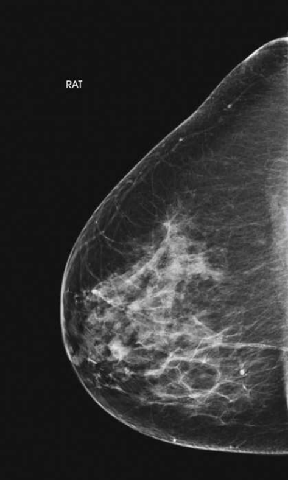

<figcaption><strong>Merrill — pagina PDF 1397, imaginea 10</strong> — Imagine din fragmentul sursă; asocierea necesită revizie.</figcaption>

</figure>

<figure class="protocol-image-card" markdown>

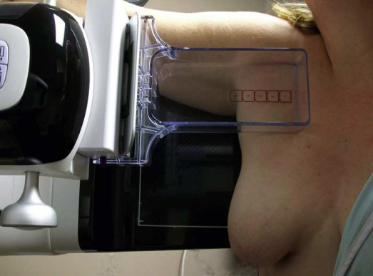

<figcaption><strong>Merrill — pagina PDF 1398, imaginea 11</strong> — Imagine din fragmentul sursă; asocierea necesită revizie.</figcaption>

</figure>

<figure class="protocol-image-card" markdown>

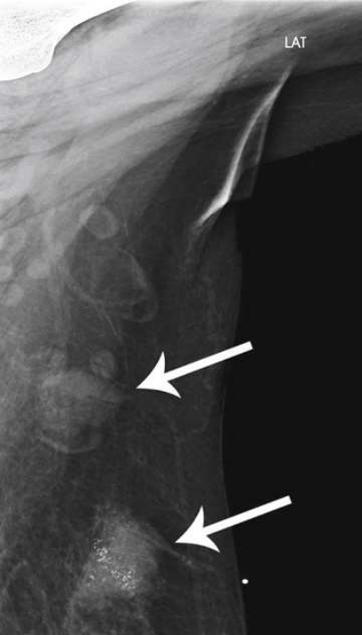

<figcaption><strong>Merrill — pagina PDF 1399, imaginea 12</strong> — Imagine din fragmentul sursă; asocierea necesită revizie.</figcaption>

</figure>

=== "Ghid Rapid de Execuție"

    1. **Identificarea și verificarea pacientului:** verificare identitate, zonă de examinat, consimțământ conform procedurii și evaluarea posibilității unei sarcini, când este relevantă.
    2. **Pregătire:** îndepărtarea oricăror obiecte radiopace (bijuterii, agrafe, fermoare, proteze, pansamente dense).
    3. **Poziționare precisă:** alinierea receptorului de imagine și a tubului la distanța prescrisă (Nespecificat în fragmentul extras; de verificat în sursă).
    4. **Colimare strictă:** adaptarea fasciculului strict la regiunea de diagnostic pentru scăderea iradierii și reducerea radiației difuze.
    5. **Radioprotecție:** verificarea [politicii RX](../radioprotectie.md), cu măsuri distincte pentru pacient, personal și însoțitor.

## Surse de documentare

- [Merrill’s Atlas, 18. Mammography, pagini PDF 1388–1399](../../assets/protocols/sources/a56d45c16829_Merrills_Atlas_of_Radiographic_Positioning__Procedures_3Vol_Set.pdf#page=1388)

## Fragmente sursă traduse (referință tehnică)

### anatomy

This incidență shows superficial lesions close la skin surface cu minimal parenchymal overlapping. It also shows skin calcifications sau
palpable lesions projected over subcutaneous fat (Fig. 18.61).
area de clinical concern este positively identified și visualized cu advantages de magnification mammography.
This incidență shows inferosuperior incidență de breast pentru improved visualization de lesions located în superior aspect ca result de
reduced object–la–receptorul de imagine distance. FB incidență poate facilitate shorter route pentru needle-wire insertion la localize inferior lesion (Fig. 18.65)
sau during în decubit ventral stereotactic core biopsy. incidență poate also fie used ca replacement pentru standard CC incidență în pacienți cu
prominent pectoral muscles sau kyphosis.
This incidență shows la de breast, cu emphasis pe its lateral aspect.
This incidență shows axilla și la de breast, cu emphasis pe its lateral aspect.

### cr

• perpendicular pe aria de interes diagnostic
• perpendicular pe imaging plate.
• perpendicular pe base de breast
• perpendicular pe receptorul de imagine (RI)
• angle de C-braț apparatus este determined prin slope de pacientul’s la.

### criteria

following trebuie să fie clearly vizualizat:
• Palpable lesion visualized over subcutaneous fat
• TAN radiopaque marker sau BB marker accurately correlated cu palpable lesion
• Minimal overlapping de adjacent parenchyma
• Calcification în parenchyma sau skin
• Uniform tissue expunere if compression este adecvat
following trebuie să fie clearly vizualizat:
• aria de interes diagnostic within collimated și self-compressed margins
following trebuie să fie clearly vizualizat:
• superior breast tissue și lesions clearly visualized
• pentru needle localization imagini, inferior lesion visualized within specialized fenestrated compression plate
• pacient’s abdomen projected clear de imagine
• Inclusion de fixed posterior tissue de superior aspect de breast
• PNL extending posteriorly la edge de imagine, measuring within ⅓ inch (1 cm) de depth de PNL pe MLO incidență
• toate medial tissue included ca vizualizat prin visualization de medial retroglandular fat și absence de fibroglandular tissue extending la
posteromedial edge de imagine
• Nipple în profile, if possible, și la midline, indicating fără exaСeration de positioning
• Some lateral tissue possibly excluded la emphasize medial tissue
• Slight medial skin reflection la cleavage, ensuring that posterior medial tissue este adequately included
• Uniform tissue expunere if compression este adecvat
Mediolateral oblic incidență pentru Axillary Tail (la)
Paddle:
8 × 10 inches (18 × 24 cm) sau 10 × 12 inches (24 × 30 cm).
following trebuie să fie clearly vizualizat:
• la cu inclusion de axillary lymph nodes under focal compression (Fig. 18.67)
• Uniform tissue expunere if compression este adecvat
• Slight skin reflection de afected braț pe superior margine de imagine
following trebuie să fie clearly vizualizat:
• la cu inclusion de axillary lymph nodes under focal compression (Fig. 18.69)
• Uniform tissue expunere if compression este adecvat
• Slight skin reflection de afected braț pe superior margine de imagine

### part_pos

pentru palpable mass
TAN incidență este most often performed cu use de magnification technique.
• Select standard, quadrant, sau spot compression paddle, ca appropriate.
• Place AEC detector la toracele perete.
• Locate aria de interes diagnostic prin palpating pacientul’s breast.
• Place radiopaque marker sau BB pe mass, sau Se instruiește pacientul să place BB pe area de concern.
• Using imaginary line între nipple și BB ca angle reference (Fig. 18.58), se rotește C-braț apparatus paralel la this
line. raza centrală este orientat tangențial pe breast la point identified prin BB marker.
• Place breast pe receptorul de imagine sau magnification stand cu aria de interes diagnostic marked prin BB pe edge de skin.
• “shadow” de BB will fie projected onto receptorul de imagine surface.
• Using appropriate compression paddle, compress breast while ensuring that enough breast tissue covers AEC detector area.
• Se aplică progresiv compresia până când glanda mamară este ferm fixată.
• Se instruiește pacientul să indicate if compression becomes uncomfortable.
• When full compression este achieved, Se instruiește pacientul să stop respirație (Figs. 18.59 și 18.60).
• Se declanșează expunerea.
• Se decomprimă sânul imediat după efectuarea expunerii.
• Place magnification platform designed pentru use cu dedicated mammography unit pe equipment.
• Place lead BB over palpable mass.
• Using your mâini, determine incidență most likely la imagine lump cu fără superimposition de other tissue. Place area de
clinical concern la edge de breast în tangent plane la imaging plate.
• palpable area de clinical concern este captured cu corner de wire coat-hanger sau inverted spot compression device. fără
additional compression este needed.
• It poate fie necessary la use manual technique if amount de tissue captured within coat-hanger sau inverted compression device
does nu cover AEC detector.
• se rotește C-braț apparatus 180 grade de la rotație used pentru routine CC incidență. tubul cap will fie near floor și
receptorul de imagine will fie above pacientul’s breast.
• în ortostatism pe medial side de breast la fie imaged, elevate inframammary fold la its maximal height.
• se ajustează height de C-braț astfel încât receptorul de imagine este în contact cu superior breast tissue.
• Lean pacientul slightly forward while gently pulling ridicat breast out și perpendicular pe chest perete. Hold breast în
poziție.
• Se instruiește pacientul să rest afected braț over top de receptorul de imagine.
• Se informează pacienta cu privire la aplicarea compresiei pe glanda mamară. Bring compression paddle de la below into contact cu pacient’s breast while sliding mână spre nipple.
• Se aplică progresiv compresia până când glanda mamară este ferm fixată.
• Se instruiește pacientul să indicate if compression becomes uncomfortable.
• la ensure that pacientul’s abdomen este nu superimposed over path de fascicul, Se instruiește pacientul să pull în abdomenul sau move hips back slightly.
• When full compression este achieved, move AEC detector la appropriate poziție, și Se instruiește pacientul să stop respirație (Fig.
18.64).
• Se declanșează expunerea.
• Se decomprimă sânul imediat după efectuarea expunerii.
• Determine grade de obliquity de C-braț apparatus prin rotating tubul until long edge de receptorul de imagine este paralel cu la de
afected side. grade de obliquity varies între 10 și 35 grade.
• se ajustează height de C-braț astfel încât superior margine de receptorul de imagine este just under axilla.
• Se instruiește pacientul să elevate braț de afected side over corner de receptorul de imagine și la rest mână pe adjacent handgrip. pacient’s cot trebuie să fie flectat.
• Se instruiește pacientul să relax afected umăr și lean it slightly anterior. Using flat surface de mână, gently pull tail de breast anteriorly și medially onto receptorul de imagine, keeping skin și tissue smooth și liber de wrinkles.
• Se instruiește pacientul să turn capul away de la side being examined și la rest capul pe / sprijinit de face guard.
• Se informează pacienta cu privire la aplicarea compresiei pe glanda mamară. Continue la hold breast în poziție while sliding mână spre
nipple ca compression paddle este brought into contact cu la (Fig. 18.66).
• Se aplică progresiv compresia până când glanda mamară este ferm fixată. corner de compression paddle trebuie să fie inferior la clavicle. la avoid
pacient discomfort caused prin corner de paddle și la facilitate even compression, remind pacientul la keep umăr
relaxat.
• Se instruiește pacientul să indicate if compression becomes uncomfortable.
• When full compression este achieved, move AEC detector la appropriate poziție, și Se instruiește pacientul să stop respirație. It
poate fie necessary la increase parametri de expunere if compression este nu ca taut ca în routine incidențe.
• Se declanșează expunerea.
• Se decomprimă sânul imediat după efectuarea expunerii.
• se rotește C-braț la approximately 70 grade.
• se ajustează height de C-braț astfel încât superior edge de receptorul de imagine este even cu top de pacientul’s umăr.
• Select appropriate compression device. quadrant paddle will capture more deep axillary tissue; standard 18 × 24 cm compression
paddle will capture additional lateral tissue și la.
• Se instruiește pacientul să elevate braț de afected side so that it este perpendicular pe corp.
• Place braț pe / sprijinit de receptorul de imagine astfel încât posterior aspect de umăr este resting pe / sprijinit de receptorul de imagine. pacientul’s braț este draped across receptorul de imagine cu forearm resting pe grip bar.
• Se instruiește pacientul să relax afected umăr și lean slightly anterior. Using flat surface de mână plasat under axillary
region, gently pull tail de breast anteriorly și medially onto receptorul de imagine, keeping skin și tissue smooth și liber de wrinkles.
• Se informează pacienta cu privire la aplicarea compresiei pe glanda mamară. Slowly bring compression down along pacientul’s coaste, cu top
edge de compression paddle skimming lower edge de pacientul’s upper braț.
• Slowly apply compression until axillary tissue feels taut. corner de compression paddle trebuie să fie inferior la clavicle. la
avoid pacient discomfort caused prin corner de paddle și la facilitate even compression, remind pacientul la keep umăr relaxat.
• Se instruiește pacientul să indicate if compression becomes uncomfortable. Vigorous compression este nu necessary pentru this incidență (Fig.
18.68).
• When full compression este achieved, move AEC detector la appropriate poziție, și Se instruiește pacientul să stop respirație. It
poate fie necessary la increase parametri de expunere if compression este nu ca taut ca în routine incidențe.
• Se declanșează expunerea.
• Se decomprimă sânul imediat după efectuarea expunerii.

### patient_pos

• Se instruiește pacientul să stand facing receptorul de imagine sau se așază pacientul pe scaun pe adjustable stool facing unit.
• Se instruiește pacientul să stand facing receptorul de imagine sau se așază pacientul pe scaun pe adjustable stool facing unit.
• Se instruiește pacientul să stand facing receptorul de imagine.
• Se instruiește pacientul să stand facing receptorul de imagine sau se așază pacientul pe scaun pe adjustable stool facing unit.
• Se instruiește pacientul să stand facing receptorul de imagine sau se așază pacientul pe scaun pe adjustable stool facing unit.

