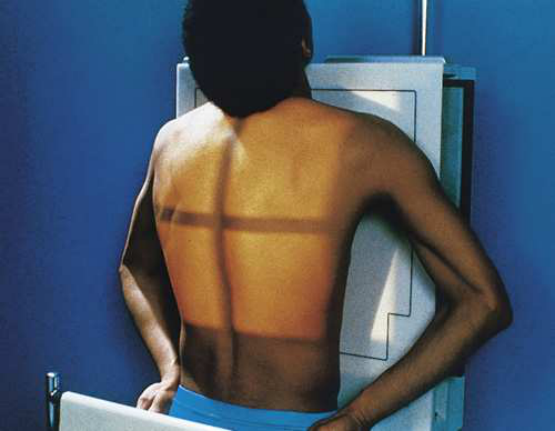
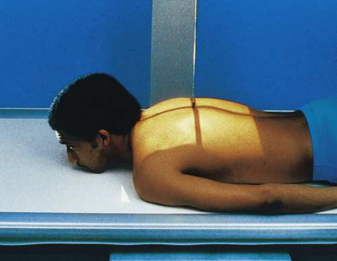
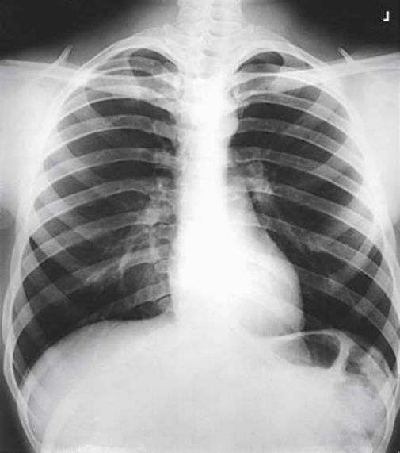

# Rx Upper Grilaj Costal Anterior — Incidență Postero-Anterioară (PA) (Merrill)

  📷 Radiografie Convențională (Rx)
  <strong>Actualizat:</strong> 2026-09-16
  <strong>Autor:</strong> Referință Merrill

---

-   __1. Rezumat Clinic & Indicații__

    ---

    === "Indicații Clinice"

        - Conform reperelor anatomice standard din tratat

    === "Ghid Național IRIS"

        !!! info "Referință Primară: Ghidul Național IRIS (Ordinul MS 1342/2012)"
            - **Capitol Ghid IRIS:** *Ghidul Național IRIS*
            - **Grad de Recomandare:** **De verificat pe indicație; fără grad atribuit automat**
            - **Nivel de Iradiere Estimată:** `De verificat pentru examinarea și populația selectate`

            [:octicons-search-16: Deschide Ghidul IRIS](../../iris.md){ .md-button .md-button--primary } [:material-open-in-new: Aplicația Oficială PWA](https://radiologie-pediatrica.ro/iris/){ .md-button target="_blank" rel="noopener" }
-   __2. Poziționare & Centrare Fascicul__

    ---

    - **Poziție Pacient:** se poziționează pacientul either în ortostatism sau Decubit, facing receptorul de imagine. Because cupole diafragmatice descends la its lowest level în ortostatism, use în ortostatism sau Poziție Șezândă-ortostatism pentru incidențe de upper Coaste (Grilaj Costal) when pacientul’s condition permits (Fig. 10.29). ortostatism este also valuable pentru evidențiind nivele hidroaerice în Torace.; se centrează MSP de pacientul’s corp la linia mediană grilă pentru bilateral Coaste (Grilaj Costal). pentru unilateral Coaste (Grilaj Costal), se centrează afected side pe longitudinal plane drawn midway între MSP și lateral surface de corp la linia mediană grilă. se ajustează receptorul de imagine poziție la project approximately 1½ inches (3.8 cm) above upper margine de umerii. Less poate fie required pentru hypersthenic pacienți și pentru those cu very muscular umeri. se sprijină pacientul’s mâini pe / sprijinit de hips cu palms turned outward la se rotește scapulae away de la rib cage. se ajustează umeri la lie în same plan transversal. If pacientul este Decubit ventral, rest capul pe bărbia și se ajustează MSP la fie vertical (Fig. 10.30). pentru hypersthenic pacienți cu wide rib cages, it poate fie necessary la move pacientul laterally pentru include entire lateral surface de afected rib area pe radiografie. se efectuează ecranarea gonadelor cu șorț plumbat.
    - **Punct de Centrare Fascicul:** perpendicular pe center de receptorul de imagine. If receptorul de imagine este poziționat correctly, raza centrală este la nivelul T7. useful option pentru evidențiind seventh, eighth, și ninth Coaste (Grilaj Costal) este la angle x-ray tube approximately 10 la 15 grade caudal. This angulation aids în projecting cupole diafragmatice below afected Coaste (Grilaj Costal).
    - **Distanță Focar-Film (DFF / SID):** Nespecificat în fragmentul extras; de verificat în sursă
    - **Comandă Respiratorie:** apnee (oprirea respirației) la Inspir profund complet la depress cupole diafragmatice ca much ca possible.

-   __3. Parametri Tehnici Expunere__

    ---

    | Parametru Tehnic | Valoare Configurare Generator / Tub |
    |:-----------------|:-------------------------------------|
    | **Tensiune Tub (kV)** | DE CONFIGURAT PE APARAT |
    | **Sarcină / Produs Curent-Timp (mAs)** | DE CONFIGURAT PE APARAT |
    | **Distanță Focar-Film (DFF / SID)** | Nespecificat în fragmentul extras; de verificat în sursă |
    | **Grilă Antidifuzoare (Bucky)** | DE CONFIGURAT PE APARAT |
    | **Dimensiune Focar** | DE CONFIGURAT PE APARAT |
    | **Camere de Ionizare AEC** | DE CONFIGURAT PE APARAT |
    | **Colimare Fascicul** | Se ajustează câmpul de iradiere la formatul 35 × 43 cm pe colimator pentru bilateral Coaste (Grilaj Costal). pentru unilateral exams, collimate width la 1 inch beyond MSP și lateral margine de side de interest. Se plasează markerul de lateralitate în câmpul colimat. |
    | **Filtrare Tub** | DE CONFIGURAT PE APARAT |

-   __4. Criterii de Calitate & Reușită Imagine__

    ---

    - Criterii radiologice de calitate imaginii:
    - Colimare adecvată vizibilă și prezența markerului de lateralitate (D/S) plasat clear de anatomy de interest
    - First through ninth Coaste (Grilaj Costal) în their entirety, cu posterior portions culcat above cupole diafragmatice
    - First through seventh anterior Coaste (Grilaj Costal) de la ambele părți (bilateral), în their entirety și above cupole diafragmatice
    - în unilateral examination, Coaste (Grilaj Costal) de la opposite side possibly nu included în their entirety
    - Bony detalii trabeculare osoase și surrounding soft tissues

-   __5. Protecție Radiologică (ALARA)__

    ---

    - Nespecificat în fragmentul extras; de verificat în sursă

!!! note "Observații Clinice & Tehnice"
    Conform reperelor anatomice standard din tratat

### 🖼️ Imagini

<figure class="protocol-image-card" markdown>

<figcaption><strong>Merrill — pagina PDF 813, imaginea 1</strong> — Imagine din fragmentul sursă; asocierea necesită revizie.</figcaption>

</figure>

<figure class="protocol-image-card" markdown>

<figcaption><strong>Merrill — pagina PDF 813, imaginea 2</strong> — Imagine din fragmentul sursă; asocierea necesită revizie.</figcaption>

</figure>

<figure class="protocol-image-card" markdown>

<figcaption><strong>Merrill — pagina PDF 814, imaginea 3</strong> — Imagine din fragmentul sursă; asocierea necesită revizie.</figcaption>

</figure>

=== "Ghid Rapid de Execuție"

    1. **Identificarea și verificarea pacientului:** verificare identitate, zonă de examinat, consimțământ conform procedurii și evaluarea posibilității unei sarcini, când este relevantă.
    2. **Pregătire:** îndepărtarea oricăror obiecte radiopace (bijuterii, agrafe, fermoare, proteze, pansamente dense).
    3. **Poziționare precisă:** alinierea receptorului de imagine și a tubului la distanța prescrisă (Nespecificat în fragmentul extras; de verificat în sursă).
    4. **Colimare strictă:** adaptarea fasciculului strict la regiunea de diagnostic pentru scăderea iradierii și reducerea radiației difuze.
    5. **Radioprotecție:** verificarea [politicii RX](../radioprotectie.md), cu măsuri distincte pentru pacient, personal și însoțitor.

## Surse de documentare

- [Merrill’s Atlas, 10. Bony Thorax, pagini PDF 812–814](../../assets/protocols/sources/a56d45c16829_Merrills_Atlas_of_Radiographic_Positioning__Procedures_3Vol_Set.pdf#page=812)

## Fragmente sursă traduse (referință tehnică)

### anatomy

anterior coaste above cupole diafragmatice (Figs. 10.31 și 10.32). Although posterior coaste sunt seen, anterior coaste sunt vizualizat cu greater detail
because they sunt closer la receptorul de imagine.

### collimation

• Se ajustează câmpul de iradiere la formatul 35 × 43 cm pe colimator pentru bilateral coaste. pentru unilateral exams, collimate width la 1
inch beyond MSP și lateral margine de side de interest. Se plasează markerul de lateralitate în câmpul colimat.

### cr

• perpendicular pe center de receptorul de imagine. If receptorul de imagine este poziționat correctly, raza centrală este la nivelul T7.
• useful option pentru evidențiind seventh, eighth, și ninth coaste este la angle x-ray tube approximately 10 la 15 grade caudal. This
angulation aids în projecting cupole diafragmatice below afected coaste.

### criteria

Criterii radiologice de calitate imaginii:
• Colimare adecvată vizibilă și prezența markerului de lateralitate (D/S) plasat clear de anatomy de interest
• First through ninth coaste în their entirety, cu posterior portions culcat above cupole diafragmatice
• First through seventh anterior coaste de la ambele părți (bilateral), în their entirety și above cupole diafragmatice
• în unilateral examination, coaste de la opposite side possibly nu included în their entirety
• Bony detalii trabeculare osoase și surrounding soft tissues

### part_pos

• se centrează MSP de pacientul’s corp la linia mediană grilă pentru bilateral coaste.
• pentru unilateral coaste, se centrează afected side pe longitudinal plane drawn midway între MSP și lateral surface de corp
la linia mediană grilă.
• se ajustează receptorul de imagine poziție la project approximately 1½ inches (3.8 cm) above upper margine de umerii. Less poate fie required pentru
hypersthenic pacienți și pentru those cu very muscular umeri.
• se sprijină pacientul’s mâini pe / sprijinit de hips cu palms turned outward la se rotește scapulae away de la rib cage.
• se ajustează umeri la lie în same plan transversal.
• If pacientul este în decubit ventral, rest capul pe bărbia și se ajustează MSP la fie vertical (Fig. 10.30).
• pentru hypersthenic pacienți cu wide rib cages, it poate fie necessary la move pacientul laterally pentru include entire lateral surface de
afected rib area pe radiografie.
• se efectuează ecranarea gonadelor cu șorț plumbat.

### patient_pos

• se poziționează pacientul either în ortostatism sau recumbent, facing receptorul de imagine.
• Because cupole diafragmatice descends la its lowest level în ortostatism, use în ortostatism sau așezat pe scaun-ortostatism pentru incidențe
de coaste superioare when pacientul’s condition permits (Fig. 10.29). ortostatism este also valuable pentru evidențiind nivele hidroaerice în chest.

### respiration

apnee (oprirea respirației) la Inspir profund complet la depress cupole diafragmatice ca much ca possible.

### tech

poziționat prin manufacturer sau department protocol pentru corect anatomy display orientation; raza centrală plate: 14 × 17 inches (35 ×
43 cm) longitudinal.

