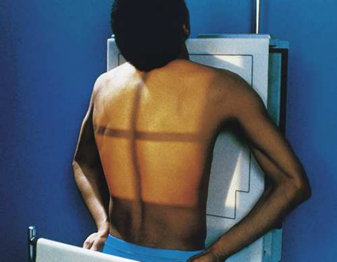
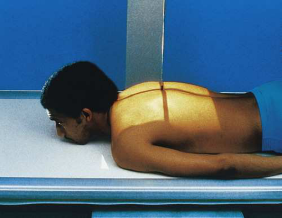
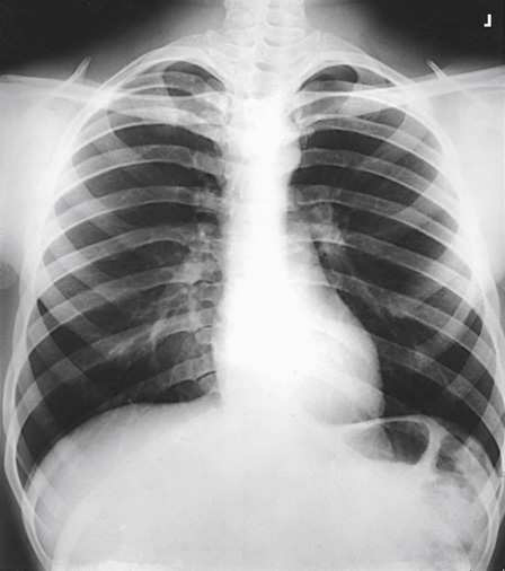

# Radiografie a coastelor superioare anterioare — incidență postero-anterioară (PA) (Merrill)

  📷 Radiografie Convențională (Rx)
  <strong>Actualizat:</strong> 2026-09-16
  <strong>Autor:</strong> Referință Merrill

---

-   __1. Rezumat Clinic & Indicații__

    ---

    === "Indicații Clinice"

        - Conform reperelor anatomice standard din tratat

    === "Ghid Național IRIS"

        !!! info "Referință Primară: Ghidul Național IRIS (Ordinul MS 1342/2012)"
            - **Capitol Ghid IRIS:** *Torace & Pulmon*
            - **Grad de Recomandare:** **Grad A**
            - **Nivel de Iradiere Estimată:** `Clasa 1 (Minimă < 0.1 mSv)`

            [:octicons-search-16: Deschide Ghidul IRIS](../../iris.md){ .md-button .md-button--primary } [:material-open-in-new: Aplicația Oficială PWA](https://radiologie-pediatrica.ro/iris/){ .md-button target="_blank" rel="noopener" }

-   __2. Poziționare & Centrare Fascicul__

    ---

    - **Poziție Pacient:** Se poziționează pacientul fie în ortostatism, fie în decubit, cu fața spre receptorul de imagine. Deoarece cupolele diafragmatice coboară la nivelul cel mai inferior în ortostatism, se utilizează ortostatismul sau poziția șezândă-ortostatism pentru incidențele coastelor superioare (grilaj costal), când starea pacientului permite (Fig. 10.29). Ortostatismul este, de asemenea, util pentru evidențierea nivelurilor hidroaerice în torace.; Se centrează MSP al corpului pacientului la linia mediană a grilei pentru coastele bilaterale (grilaj costal). Pentru coastele unilaterale (grilaj costal), se centrează partea afectată pe planul longitudinal tras la jumătatea distanței dintre MSP și suprafața laterală a corpului, la linia mediană a grilei. Se ajustează poziția receptorului de imagine pentru a proiecta aproximativ 1½ țoli (3,8 cm) deasupra marginii superioare a umerilor. Poate fi necesar mai puțin pentru pacienții hiperstenici și pentru cei cu umeri foarte musculoși. Se sprijină mâinile pacientului pe șolduri, cu palmele orientate spre exterior, pentru a roti scapulele în afara cutiei toracice. Se ajustează umerii astfel încât să se afle în același plan transversal. Dacă pacientul este în decubit ventral, se sprijină capul pe bărbie și se ajustează MSP pentru a fi vertical (Fig. 10.30). Pentru pacienții hiperstenici cu cutii toracice largi, poate fi necesară deplasarea laterală a pacientului pentru a include întreaga suprafață laterală a regiunii costale afectate pe radiografie. Se efectuează ecranarea gonadelor cu șorț plumbat.
    - **Punct de Centrare Fascicul:** Perpendicular pe centrul receptorului de imagine. Dacă receptorul de imagine este poziționat corect, raza centrală este la nivelul T7. O opțiune utilă pentru evidențierea coastelor a șaptea, a opta și a noua este angularea tubului radiogen cu aproximativ 10 la 15 grade caudal. Această angulare ajută la proiectarea cupolelor diafragmatice sub coastele afectate.
    - **Distanță Focar-Film (DFF / SID):** Nespecificat în fragmentul extras; de verificat în sursă
    - **Comandă Respiratorie:** Apnee (oprirea respirației) la inspir profund complet pentru a coborî cupolele diafragmatice cât mai mult posibil.

-   __3. Parametri Tehnici Expunere__

    ---

    | Parametru Tehnic | Valoare Configurare Generator / Tub |
    |:-----------------|:-------------------------------------|
    | **Tensiune Tub (kV)** | DE CONFIGURAT PE APARAT |
    | **Sarcină / Produs Curent-Timp (mAs)** | DE CONFIGURAT PE APARAT |
    | **Distanță Focar-Film (DFF / SID)** | Nespecificat în fragmentul extras; de verificat în sursă |
    | **Grilă Antidifuzoare (Bucky)** | DE CONFIGURAT PE APARAT |
    | **Dimensiune Focar** | DE CONFIGURAT PE APARAT |
    | **Camere de Ionizare AEC** | DE CONFIGURAT PE APARAT |
    | **Colimare Fascicul** | Se ajustează câmpul de iradiere la formatul 35 × 43 cm pe colimator pentru coaste bilaterale (grilaj costal). Pentru examinările unilaterale, se colimează cu 1 țol dincolo de MSP și de marginea laterală a părții de interes. Se plasează markerul de lateralitate în câmpul colimat. |
    | **Filtrare Tub** | DE CONFIGURAT PE APARAT |

-   __4. Criterii de Calitate & Reușită Imagine__

    ---

    - Criterii radiologice de calitate a imaginii:
    - Colimare adecvată vizibilă și prezența markerului de lateralitate (D/S) plasat în afara structurilor anatomice de interes
    - Coastele de la prima până la a noua în întregime, cu porțiunile posterioare situate deasupra cupolelor diafragmatice
    - Coastele anterioare de la prima până la a șaptea, de ambele părți (bilateral), în întregime și deasupra cupolelor diafragmatice
    - La examinarea unilaterală, coastele de pe partea opusă pot să nu fie incluse în întregime
    - Detalii trabeculare osoase și țesuturile moi înconjurătoare

-   __5. Protecție Radiologică (ALARA)__

    ---

    - Nespecificat în fragmentul extras; de verificat în sursă

!!! note "Observații Clinice & Tehnice"
    Conform reperelor anatomice standard din tratat

### 🖼️ Imagini

<figure class="protocol-image-card" markdown>

<figcaption><strong>Merrill — pagina 813, imaginea 1</strong> — Imagine din fragmentul sursă; asocierea necesită revizie.</figcaption>

</figure>

<figure class="protocol-image-card" markdown>

<figcaption><strong>Merrill — pagina 813, imaginea 2</strong> — Imagine din fragmentul sursă; asocierea necesită revizie.</figcaption>

</figure>

<figure class="protocol-image-card" markdown>

<figcaption><strong>Merrill — pagina 814, imaginea 3</strong> — Imagine din fragmentul sursă; asocierea necesită revizie.</figcaption>

</figure>

=== "Ghid Rapid de Execuție"

    1. **Identificarea și verificarea pacientului:** verificare identitate, zonă de examinat, consimțământ conform procedurii și evaluarea posibilității unei sarcini, când este relevantă.
    2. **Pregătire:** îndepărtarea oricăror obiecte radiopace (bijuterii, agrafe, fermoare, proteze, pansamente dense).
    3. **Poziționare precisă:** alinierea receptorului de imagine și a tubului la distanța prescrisă (Nespecificat în fragmentul extras; de verificat în sursă).
    4. **Colimare strictă:** adaptarea fasciculului strict la regiunea de diagnostic pentru scăderea iradierii și reducerea radiației difuze.
    5. **Radioprotecție:** verificarea [politicii RX](../radioprotectie.md), cu măsuri distincte pentru pacient, personal și însoțitor.

## Surse de documentare

- [Merrill’s Atlas, 10. Bony Thorax, pagini 812–814](https://books.google.com/books/about/Merrill_s_Atlas_of_Radiographic_Position.html?id=BM0lEQAAQBAJ)
