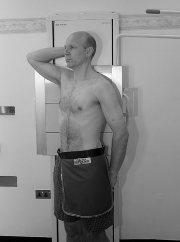
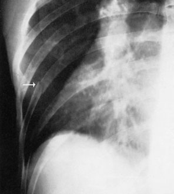
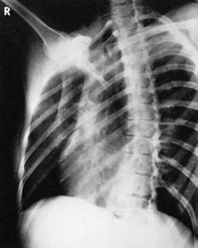
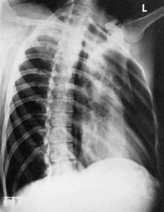

# Rx Upper Coaste (Grilaj Costal) Right and left Oblică Posterioară

  📷 Radiografie Convențională (Rx)
  <strong>Actualizat:</strong> 2026-09-16
  <strong>Autor:</strong> Departamentul de Radiologie / Referință Clark (Ed. 12)

---

-   __1. Rezumat Clinic & Indicații__

    ---

    === "Indicații Clinice"

        - casetă este selected that este large enough pentru include whole de Coaste (Grilaj Costal) pe side being examined de la level de seventh cervical vertebra la lower costal margin.

    === "Ghid Național IRIS"

        !!! info "Referință Primară: Ghidul Național IRIS (Ordinul MS 1342/2012)"
            - **Capitol Ghid IRIS:** *Ghidul Național IRIS*
            - **Grad de Recomandare:** **De verificat pe indicație; fără grad atribuit automat**
            - **Nivel de Iradiere Estimată:** `De verificat pentru examinarea și populația selectate`

            [:octicons-search-16: Deschide Ghidul IRIS](../../iris.md){ .md-button .md-button--primary } [:material-open-in-new: Aplicația Oficială PWA](https://radiologie-pediatrica.ro/iris/){ .md-button target="_blank" rel="noopener" }
-   __2. Poziționare & Centrare Fascicul__

    ---

    - **Poziție Pacient:** • pacientul stă așezat sau stands cu posterior aspect de trunk pe / sprijinit de stativ vertical Bucky. Alternatively, pacientul este culcat Decubit dorsal pe masa radiologică.
• mid-clavicular line de side under examination trebuie să coincide cu central line de Bucky sau table.
• trunk este rotit 45 grade spre side being examined și, if Decubit dorsal, este sprijinit pe non-opaque pads.
• If condition de pacientul permits, mâinile trebuie să fie clasped behind capul, otherwise brațele trebuie să fie held clear de trunk.
• cranial edge de caseta trebuie să fie poziționat la level just above spinous process de seventh cervical vertebra.
    - **Punct de Centrare Fascicul:** • Initially, se orientează raza centrală centrală perpendicular pe casetă și spre sternal angle.
• Then angle fascicul caudally astfel încât raza centrală coincides cu centre de caseta. This assists în evidențiind maximum number de Coaste (Grilaj Costal) above cupole diafragmatice.
• expunere made pe arrested inspir profund complet will also assist în maximizing number de Coaste (Grilaj Costal) evidențiat.
    - **Distanță Focar-Film (DFF / SID):** 100 cm
    - **Comandă Respiratorie:** Apnee pe durata expunerii (apnee în inspir pentru torace; expir pentru Abdomen/bazin).

-   __3. Parametri Tehnici Expunere__

    ---

    | Parametru Tehnic | Valoare Configurare Generator / Tub |
    |:-----------------|:-------------------------------------|
    | **Tensiune Tub (kV)** | DE CONFIGURAT PE APARAT |
    | **Sarcină / Produs Curent-Timp (mAs)** | Conform AEC / grosime anatomică |
    | **Distanță Focar-Film (DFF / SID)** | 100 cm |
    | **Grilă Antidifuzoare (Bucky)** | Cu grilă antidifuzoare Bucky |
    | **Dimensiune Focar** | Focar Mic (0.6 mm) |
    | **Camere de Ionizare AEC** | Camerele laterale (sau camera centrală funcție de regiune) |
    | **Colimare Fascicul** | Colimare strictă la aria anatomică de interes diagnostic |
    | **Filtrare Tub** | Totală ≥ 2.5 mm Al echivalent (conform Clark: 3.0 mm Al eq.) |

-   __4. Criterii de Calitate & Reușită Imagine__

    ---

    - Vizualizarea clară întregii arii anatomice (Upper Coaste (Grilaj Costal)).
    - Absența artefactelor de mișcare; trabeculație osoasă și contururi nete.
    - Densitate optică și contrast adecvate pentru diferențierea țesuturilor moi de structurile osoase.

-   __5. Protecție Radiologică (ALARA)__

    ---

    - Ecranare gonadică cu șorț plumbat dacă gonadele sunt în apropierea fasciculului util (regula ALARA).
    - Colimare precisă la dimensiunea anatomică strict necesară pentru reducerea dozei și a radiației difuze.
    - Verificarea posibilității unei sarcini la pacientele de vârstă fertilă înainte de expunere.

!!! note "Observații Clinice & Tehnice"
    kVp trebuie să fie sufficient la reduce difference în subject contrast între câmpuri pulmonare și Cord și Siluetă Cardiovasculară la more uniform radiographic contrast astfel încât Coaste (Grilaj Costal) sunt visualized adequately în ambele these areas.
224 radiografie de drept lower Coaste (Grilaj Costal) evidențiind acute suspiciune de fractură X-ray tube Oblică ray Dome de cupole diafragmatice Stern raza centrală casetă drept Oblică Posterioară stâng Oblică Posterioară Dotted line shows cupole diafragmatice projected downwards

### 🖼️ Imagini

<figure class="protocol-image-card" markdown>

<figcaption><strong>radiografie poate fie conducted cu pacientul Ortostatism sau Decubit dorsal.</strong> — Poziționare pacient și centrare fascicul conform Clark (Ed. 12)</figcaption>

</figure>

<figure class="protocol-image-card" markdown>

<figcaption><strong>radiographic contrast astfel încât Coaste (Grilaj Costal) sunt visualized adequately</strong> — Aspect radiografic / ghid de poziționare conform tratatului Clark (Ed. 12)</figcaption>

</figure>

<figure class="protocol-image-card" markdown>

<figcaption><strong>radiografie de drept lower Coaste (Grilaj Costal) evidențiind acute suspiciune de fractură</strong> — Aspect radiografic / ghid de poziționare conform tratatului Clark (Ed. 12)</figcaption>

</figure>

<figure class="protocol-image-card" markdown>

<figcaption><strong>Figura 4: Aspect radiografic / Poziționare (Clark Ed. 12)</strong> — Aspect radiografic / ghid de poziționare conform tratatului Clark (Ed. 12)</figcaption>

</figure>

=== "Ghid Rapid de Execuție"

    1. **Identificarea și verificarea pacientului:** verificare identitate, zonă de examinat, consimțământ conform procedurii și evaluarea posibilității unei sarcini, când este relevantă.
    2. **Pregătire:** îndepărtarea oricăror obiecte radiopace (bijuterii, agrafe, fermoare, proteze, pansamente dense).
    3. **Poziționare precisă:** alinierea receptorului de imagine și a tubului la distanța prescrisă (100 cm).
    4. **Colimare strictă:** adaptarea fasciculului strict la regiunea de diagnostic pentru scăderea iradierii și reducerea radiației difuze.
    5. **Radioprotecție:** verificarea [politicii RX](../radioprotectie.md), cu măsuri distincte pentru pacient, personal și însoțitor.

## Surse de documentare

- [Clark's Positioning in Radiography (Ed. 12), Pagina 239](../../assets/protocols/sources/Clark___Positioning_in_Radiography__12th_edition.pdf#page=239)
