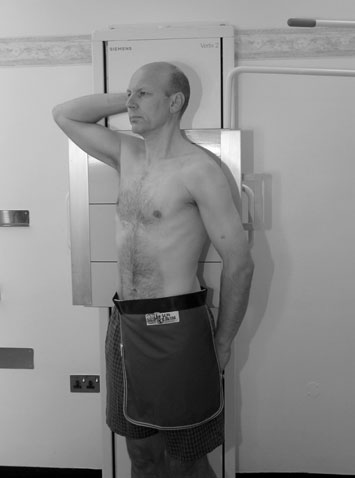
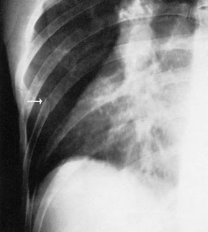
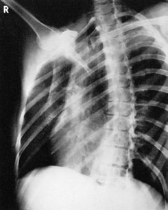
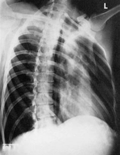

# Rx coaste superioare (grilaj costal) oblică posterioară dreaptă și stângă

  📷 Radiografie Convențională (Rx)
  <strong>Actualizat:</strong> 2026-09-16
  <strong>Autor:</strong> Departamentul de Radiologie / Referință Clark (Ed. 12)

---

-   __1. Rezumat Clinic & Indicații__

    ---

    === "Indicații Clinice"

        - Se selectează o casetă suficient de mare pentru a include toate coastele (grilaj costal) de pe partea examinată, de la nivelul celei de-a șaptea vertebre cervicale până la marginea costală inferioară.

    === "Ghid Național IRIS"

        !!! info "Referință Primară: Ghidul Național IRIS (Ordinul MS 1342/2012)"
            - **Capitol Ghid IRIS:** *Torace & Pulmon*
            - **Grad de Recomandare:** **Grad A**
            - **Nivel de Iradiere Estimată:** `Clasa 1 (Minimă < 0.1 mSv)`

            [:octicons-search-16: Deschide Ghidul IRIS](../../iris.md){ .md-button .md-button--primary } [:material-open-in-new: Aplicația Oficială PWA](https://radiologie-pediatrica.ro/iris/){ .md-button target="_blank" rel="noopener" }

-   __2. Poziționare & Centrare Fascicul__

    ---

    - **Poziție Pacient:**
        - Pacientul stă așezat sau în ortostatism, cu aspectul posterior al trunchiului pe / sprijinit de stativul vertical Bucky. Alternativ, pacientul este culcat în decubit dorsal pe masa radiologică.
        - Linia medioclaviculară a părții examinate trebuie să coincidă cu linia centrală a stativului Bucky sau a mesei.
        - Trunchiul este rotit la 45 grade spre partea examinată și, în decubit dorsal, este sprijinit pe suporturi radiotransparente.
        - Dacă starea pacientului permite, mâinile trebuie ținute împreunate în spatele capului; altfel, brațele trebuie menținute în afara trunchiului.
        - Marginea cranială a casetei trebuie poziționată la nivelul situat imediat deasupra apofizei spinoase a celei de-a șaptea vertebre cervicale.
    - **Punct de Centrare Fascicul:**
        - Inițial, se orientează raza centrală perpendicular pe casetă și spre unghiul sternal.
        - Apoi se angulează fasciculul caudal astfel încât raza centrală să coincidă cu centrul casetei. Acest lucru ajută la evidențierea numărului maxim de coaste (grilaj costal) deasupra cupolelor diafragmatice.
        - Expunerea efectuată în apnee inspiratorie profundă completă va ajuta, de asemenea, la maximizarea numărului de coaste (grilaj costal) evidențiate.
    - **Distanță Focar-Film (DFF / SID):** 100 cm
    - **Comandă Respiratorie:** Apnee pe durata expunerii (apnee în inspir pentru torace; expir pentru Abdomen/bazin).

-   __3. Parametri Tehnici Expunere__

    ---

    | Parametru Tehnic | Valoare Configurare Generator / Tub |
    |:-----------------|:-------------------------------------|
    | **Tensiune Tub (kV)** | DE CONFIGURAT PE APARAT |
    | **Sarcină / Produs Curent-Timp (mAs)** | Conform AEC / grosimii anatomice |
    | **Distanță Focar-Film (DFF / SID)** | 100 cm |
    | **Grilă Antidifuzoare (Bucky)** | Cu grilă antidifuzoare Bucky |
    | **Dimensiune Focar** | Focar Mic (0.6 mm) |
    | **Camere de Ionizare AEC** | Camerele laterale (sau camera centrală, în funcție de regiune) |
    | **Colimare Fascicul** | Colimare strictă la aria anatomică de interes diagnostic |
    | **Filtrare Tub** | Totală ≥ 2.5 mm Al echivalent (conform Clark: 3.0 mm Al echivalent) |

-   __4. Criterii de Calitate & Reușită Imagine__

    ---

    - Vizualizarea clară a întregii arii anatomice (coaste superioare (grilaj costal)).
    - Absența artefactelor de mișcare; trabeculație osoasă și contururi nete.
    - Densitate optică și contrast adecvate pentru diferențierea țesuturilor moi de structurile osoase.

-   __5. Protecție Radiologică (ALARA)__

    ---

    - Ecranare gonadică cu șorț plumbat dacă gonadele sunt în apropierea fasciculului util (regula ALARA).
    - Colimare precisă la dimensiunea anatomică strict necesară pentru reducerea dozei și a radiației difuze.
    - Verificarea posibilității unei sarcini la pacientele de vârstă fertilă înainte de expunere.

!!! note "Observații Clinice & Tehnice"
    kVp trebuie să fie suficient pentru a reduce diferența de contrast al subiectului între câmpurile pulmonare și cord și silueta cardiovasculară, la un contrast radiografic mai uniform, astfel încât coastele să fie vizualizate adecvat în ambele zone. 224 Radiografie a coastelor inferioare drepte evidențiind suspiciune de fractură acută. Tub radiogen. Rază oblică. Cupola diafragmatică. Stern. Rază centrală. Casetă. Oblică dreaptă. Oblică posterioară stângă. Linia punctată arată cupolele diafragmatice proiectate în jos

### 🖼️ Imagini

<figure class="protocol-image-card" markdown>

<figcaption><strong>Radiografia poate fi efectuată cu pacientul în ortostatism sau în decubit dorsal.</strong> — Poziționarea pacientului și centrarea fasciculului conform Clark (Ed. 12)</figcaption>

</figure>

<figure class="protocol-image-card" markdown>

<figcaption><strong>Contrast radiografic care să permită vizualizarea adecvată a coastelor (grilajului costal)</strong> — Aspect radiografic / ghid de poziționare conform tratatului Clark (Ed. 12)</figcaption>

</figure>

<figure class="protocol-image-card" markdown>

<figcaption><strong>Radiografie a coastelor inferioare drepte (grilaj costal), evidențiind suspiciunea unei fracturi acute</strong> — Aspect radiografic / ghid de poziționare conform tratatului Clark (Ed. 12)</figcaption>

</figure>

<figure class="protocol-image-card" markdown>

<figcaption><strong>Figura 4: Aspect radiografic / Poziționare (Clark Ed. 12)</strong> — Aspect radiografic / ghid de poziționare conform tratatului Clark (Ed. 12)</figcaption>

</figure>

=== "Ghid Rapid de Execuție"

    1. **Identificarea și verificarea pacientului:** verificare identitate, zonă de examinat, consimțământ conform procedurii și evaluarea posibilității unei sarcini, când este relevantă.
    2. **Pregătire:** îndepărtarea oricăror obiecte radiopace (bijuterii, agrafe, fermoare, proteze, pansamente dense).
    3. **Poziționare precisă:** alinierea receptorului de imagine și a tubului la distanța prescrisă (100 cm).
    4. **Colimare strictă:** adaptarea fasciculului strict la regiunea de diagnostic pentru scăderea iradierii și reducerea radiației difuze.
    5. **Radioprotecție:** verificarea [politicii RX](../radioprotectie.md), cu măsuri distincte pentru pacient, personal și însoțitor.

## Surse de documentare

- [Clark's Positioning in Radiography (Ed. 12), Pagina 239](https://books.google.com/books/about/Clark_s_Positioning_in_Radiography.html?id=Xxu6MwEACAAJ)
